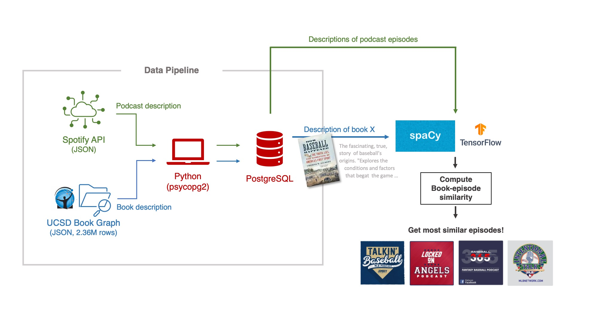

# book-to-podcast

This is a code demonstration of creating an ETL pipeline and functions that provide users podcast episodes based on their interested books.

Check `Insight 2020-11-09.ipynb` for more details.

