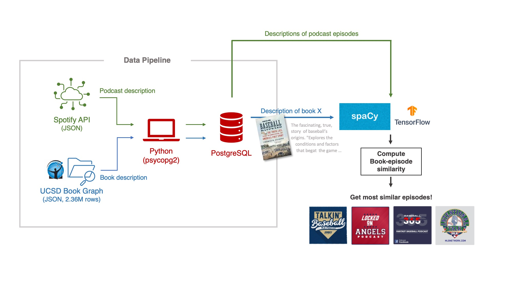
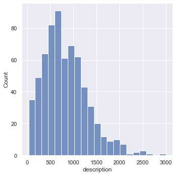
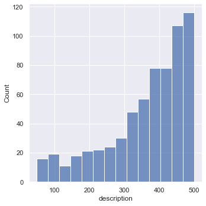
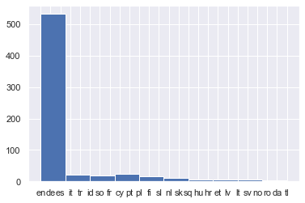
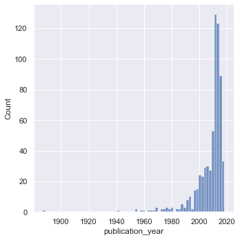

## From Your Favorite Book to Your Favorite Podcast
Insight Fellowship・Data Demonstration<br/>
Carl Huang ( http://carlhuang.com )<br/>
Nov 9, 2020


```python
from IPython.display import Image
Image(filename='architecture.jpg')
```


    

    


```python
import re
import time
import json
import configparser
import psycopg2
import random
import logging
import string
import spacy
import spotipy
from spotipy.oauth2 import SpotifyClientCredentials
from spotipy.oauth2 import SpotifyOAuth

import pandas as pd
import seaborn as sns
import tensorflow as tf
from langdetect import detect
from datetime import datetime

sns.set_theme(style="darkgrid")
pd.options.mode.chained_assignment = None
logging.getLogger('tensorflow').disabled = True
```

## 1. Data Pipeline
### 1.1 Using class to handle ETL
Since both the `Spotify API` and `UCSD Book Graph` pipelines involves (1) extracting JSON data, (2) transform data, and (3) loading data into PostgreSQL, I will build a general class to reduce redundant codes:


```python
class etl_handler(object):
    "A class that loads a JSON file, transform data, and insert data into PostgreSQL tables"
    def __init__(self):
        self.config = '/Users/Carl/_data Science/_project/book to podcast/database.ini'
        self.data = None
    
    def psql_insert(self):
        return self.insert_table

    # Loading functions
    def load_json(self, json_file: str, max_line = None):
        """
        Takes a JSON file path and maximum lines to be loaded.
        Saves loaded data in self.data
        """
        data = []
        count = 0
        with open(json_file, 'r') as f:
            for line in f:
                dict_ = json.loads(line)
                data.append(dict_)
                count += 1
                if max_line:
                    if count == max_line:
                        break
            self.data = pd.DataFrame(data)

    # Data wrangling/cleaning functions
    def get_data(self, rows: int = None, random_draw: bool = False, seed: int = None):
        """
        Takes the number of rows to be displayed and whether a randome sample should be drawn.
        Returns a pandas DataFrame with specifications above.
        """
        if self.data is not None:
            if not rows:
                # If 'row' is not given, the all rows from self.data will be read.
                rows = self.data.shape[0]
            if random_draw:
                if seed:
                    return self.data.sample(n=rows, random_state=seed)
            else:
                return self.data[:rows]
        else:
            print("Error. Data not loaded. User load_json() to load data first.")
    
    def select_columns(self, cols: list):
        """Limit the columns of self.data to the columne list provided"""
        self.data = self.data[cols]
    
    def add_column(self, col_name, content):
        """Add a new column to self.data with content provided in *content* """
        self.data[col_name] = content
    
    def filter_value(self, column, value, how = None):
        """Only keeps examples that match the value conditions specified in argument"""
        if how == '==':
            self.data = self.data.loc[self.data[column] == value]

        if how == '>=':
            self.data = self.data.loc[self.data[column] >= value]

        if how == '>':
            self.data = self.data.loc[self.data[column] > value]

        if how == '<=':
            self.data = self.data.loc[self.data[column] <= value]

        if how == '<':
            self.data = self.data.loc[self.data[column] < value]
        
        self.data = self.data.reset_index(drop=True)
        return None
        
    def column_function(self, cols: list, func):
        """Apply function *func* to the specified column in self.data"""
        for col in cols:
            new_col = self.data[col].map(func)
            self.data.loc[:, col] = new_col
        return None
    
    def drop_na(self):
        self.data = self.data.dropna()
        self.data = self.data.reset_index(drop=True)
        return None
    
    # PSQL helper functions
    def psql_connect(self):
        "Given a confige file (config.ini), this function locates information PostgreSQL "
        config = configparser.ConfigParser()
        config.read(self.config)
        connection = psycopg2.connect(
            host = config['postgres']['host'],
            database = config['postgres']['database'],
            user = config['postgres']['user'],
            password = config['postgres']['password']
            )
        cursor = connection.cursor()
        return connection, cursor
```

### 1.1.1 Loading Book Data from UCSD Book Graph


```python
class bookgraph_etl(etl_handler):
    def __init__(self):
        super().__init__()
        self.create_table = ("""CREATE TABLE IF NOT EXISTS book(
                                book_id bigint PRIMARY KEY,
                                year smallint NOT NULL,
                                rating_counts int NOT NULL,
                                title varchar(250) NOT NULL UNIQUE,
                                description varchar(500),
                                authors varchar(250),
                                language varchar(20))""")
        
        self.insert_table = ("""INSERT INTO book 
                               (book_id, year, rating_counts, title, description, authors, language)
                               VALUES (%s, %s, %s, %s, %s, %s, %s)
                               ON CONFLICT DO NOTHING""")
        
    def psql_create(self):
        return self.create_table

    def psql_insert(self):
        return self.insert_table
```


```python
bookgraph = bookgraph_etl()
bookgraph.load_json('/Users/Carl/_data Science/_data/UCSD Bookgraph/goodreads_books.json', max_line = 1_000)
```


```python
bookgraph.get_data(rows=5)
```


<div>
<style scoped>
    .dataframe tbody tr th:only-of-type {
        vertical-align: middle;
    }

    .dataframe tbody tr th {
        vertical-align: top;
    }

    .dataframe thead th {
        text-align: right;
    }
</style>
<table border="1" class="dataframe">
  <thead>
    <tr style="text-align: right;">
      <th></th>
      <th>isbn</th>
      <th>text_reviews_count</th>
      <th>series</th>
      <th>country_code</th>
      <th>language_code</th>
      <th>popular_shelves</th>
      <th>asin</th>
      <th>is_ebook</th>
      <th>average_rating</th>
      <th>kindle_asin</th>
      <th>...</th>
      <th>publication_month</th>
      <th>edition_information</th>
      <th>publication_year</th>
      <th>url</th>
      <th>image_url</th>
      <th>book_id</th>
      <th>ratings_count</th>
      <th>work_id</th>
      <th>title</th>
      <th>title_without_series</th>
    </tr>
  </thead>
  <tbody>
    <tr>
      <th>0</th>
      <td>0312853122</td>
      <td>1</td>
      <td>[]</td>
      <td>US</td>
      <td></td>
      <td>[{'count': '3', 'name': 'to-read'}, {'count': ...</td>
      <td></td>
      <td>false</td>
      <td>4.00</td>
      <td></td>
      <td>...</td>
      <td>9</td>
      <td></td>
      <td>1984</td>
      <td>https://www.goodreads.com/book/show/5333265-w-...</td>
      <td>https://images.gr-assets.com/books/1310220028m...</td>
      <td>5333265</td>
      <td>3</td>
      <td>5400751</td>
      <td>W.C. Fields: A Life on Film</td>
      <td>W.C. Fields: A Life on Film</td>
    </tr>
    <tr>
      <th>1</th>
      <td>0743509986</td>
      <td>6</td>
      <td>[]</td>
      <td>US</td>
      <td></td>
      <td>[{'count': '2634', 'name': 'to-read'}, {'count...</td>
      <td></td>
      <td>false</td>
      <td>3.23</td>
      <td>B000FC0PBC</td>
      <td>...</td>
      <td>10</td>
      <td>Abridged</td>
      <td>2001</td>
      <td>https://www.goodreads.com/book/show/1333909.Go...</td>
      <td>https://s.gr-assets.com/assets/nophoto/book/11...</td>
      <td>1333909</td>
      <td>10</td>
      <td>1323437</td>
      <td>Good Harbor</td>
      <td>Good Harbor</td>
    </tr>
    <tr>
      <th>2</th>
      <td></td>
      <td>7</td>
      <td>[189911]</td>
      <td>US</td>
      <td>eng</td>
      <td>[{'count': '58', 'name': 'to-read'}, {'count':...</td>
      <td>B00071IKUY</td>
      <td>false</td>
      <td>4.03</td>
      <td></td>
      <td>...</td>
      <td></td>
      <td>Book Club Edition</td>
      <td>1987</td>
      <td>https://www.goodreads.com/book/show/7327624-th...</td>
      <td>https://images.gr-assets.com/books/1304100136m...</td>
      <td>7327624</td>
      <td>140</td>
      <td>8948723</td>
      <td>The Unschooled Wizard (Sun Wolf and Starhawk, ...</td>
      <td>The Unschooled Wizard (Sun Wolf and Starhawk, ...</td>
    </tr>
    <tr>
      <th>3</th>
      <td>0743294297</td>
      <td>3282</td>
      <td>[]</td>
      <td>US</td>
      <td>eng</td>
      <td>[{'count': '7615', 'name': 'to-read'}, {'count...</td>
      <td></td>
      <td>false</td>
      <td>3.49</td>
      <td>B002ENBLOK</td>
      <td>...</td>
      <td>7</td>
      <td></td>
      <td>2009</td>
      <td>https://www.goodreads.com/book/show/6066819-be...</td>
      <td>https://s.gr-assets.com/assets/nophoto/book/11...</td>
      <td>6066819</td>
      <td>51184</td>
      <td>6243154</td>
      <td>Best Friends Forever</td>
      <td>Best Friends Forever</td>
    </tr>
    <tr>
      <th>4</th>
      <td>0850308712</td>
      <td>5</td>
      <td>[]</td>
      <td>US</td>
      <td></td>
      <td>[{'count': '32', 'name': 'to-read'}, {'count':...</td>
      <td></td>
      <td>false</td>
      <td>3.40</td>
      <td></td>
      <td>...</td>
      <td></td>
      <td></td>
      <td></td>
      <td>https://www.goodreads.com/book/show/287140.Run...</td>
      <td>https://images.gr-assets.com/books/1413219371m...</td>
      <td>287140</td>
      <td>15</td>
      <td>278577</td>
      <td>Runic Astrology: Starcraft and Timekeeping in ...</td>
      <td>Runic Astrology: Starcraft and Timekeeping in ...</td>
    </tr>
  </tbody>
</table>
<p>5 rows × 29 columns</p>
</div>


### 1.1.2 Select Relevant Columns, Set Data Type
The original `bookgraph` data has 29 columns.


```python
bookgraph.get_data().columns
```


    Index(['isbn', 'text_reviews_count', 'series', 'country_code', 'language_code',
           'popular_shelves', 'asin', 'is_ebook', 'average_rating', 'kindle_asin',
           'similar_books', 'description', 'format', 'link', 'authors',
           'publisher', 'num_pages', 'publication_day', 'isbn13',
           'publication_month', 'edition_information', 'publication_year', 'url',
           'image_url', 'book_id', 'ratings_count', 'work_id', 'title',
           'title_without_series'],
          dtype='object')


To provide users recommendation and relevant information, I trim down the original data into these columns below, and separate them based on "numeric" and "categorical":


```python
int_cols = ['book_id', 'publication_year', 'ratings_count']
str_cols = ['title', 'description', 'authors']
bookgraph.select_columns(int_cols+str_cols)
```


```python
def int_transform(text):
    return int(text) if text != '' else None

def str_transform(text):
    return text if len(text) != 0 else None

bookgraph.column_function(int_cols, int_transform)
bookgraph.column_function(str_cols, str_transform)
```


```python
bookgraph.get_data()
```


<div>
<style scoped>
    .dataframe tbody tr th:only-of-type {
        vertical-align: middle;
    }

    .dataframe tbody tr th {
        vertical-align: top;
    }

    .dataframe thead th {
        text-align: right;
    }
</style>
<table border="1" class="dataframe">
  <thead>
    <tr style="text-align: right;">
      <th></th>
      <th>book_id</th>
      <th>publication_year</th>
      <th>ratings_count</th>
      <th>title</th>
      <th>description</th>
      <th>authors</th>
    </tr>
  </thead>
  <tbody>
    <tr>
      <th>0</th>
      <td>5333265</td>
      <td>1984.0</td>
      <td>3</td>
      <td>W.C. Fields: A Life on Film</td>
      <td>None</td>
      <td>[{'author_id': '604031', 'role': ''}]</td>
    </tr>
    <tr>
      <th>1</th>
      <td>1333909</td>
      <td>2001.0</td>
      <td>10</td>
      <td>Good Harbor</td>
      <td>Anita Diamant's international bestseller "The ...</td>
      <td>[{'author_id': '626222', 'role': ''}]</td>
    </tr>
    <tr>
      <th>2</th>
      <td>7327624</td>
      <td>1987.0</td>
      <td>140</td>
      <td>The Unschooled Wizard (Sun Wolf and Starhawk, ...</td>
      <td>Omnibus book club edition containing the Ladie...</td>
      <td>[{'author_id': '10333', 'role': ''}]</td>
    </tr>
    <tr>
      <th>3</th>
      <td>6066819</td>
      <td>2009.0</td>
      <td>51184</td>
      <td>Best Friends Forever</td>
      <td>Addie Downs and Valerie Adler were eight when ...</td>
      <td>[{'author_id': '9212', 'role': ''}]</td>
    </tr>
    <tr>
      <th>4</th>
      <td>287140</td>
      <td>NaN</td>
      <td>15</td>
      <td>Runic Astrology: Starcraft and Timekeeping in ...</td>
      <td>None</td>
      <td>[{'author_id': '149918', 'role': ''}]</td>
    </tr>
    <tr>
      <th>...</th>
      <td>...</td>
      <td>...</td>
      <td>...</td>
      <td>...</td>
      <td>...</td>
      <td>...</td>
    </tr>
    <tr>
      <th>995</th>
      <td>16034992</td>
      <td>2005.0</td>
      <td>52</td>
      <td>Το άλικο γράμμα</td>
      <td>Bostone, mesa tou 17ou aiona. Mia neare gunaik...</td>
      <td>[{'author_id': '7799', 'role': ''}, {'author_i...</td>
    </tr>
    <tr>
      <th>996</th>
      <td>10290982</td>
      <td>NaN</td>
      <td>68</td>
      <td>Clockwork Fairies</td>
      <td>Desiree feels the most at home with her clockw...</td>
      <td>[{'author_id': '1014253', 'role': ''}]</td>
    </tr>
    <tr>
      <th>997</th>
      <td>7561212</td>
      <td>NaN</td>
      <td>9</td>
      <td>Speed Shrinking</td>
      <td>"Proust had a cookie. Susan Shapiro has a cupc...</td>
      <td>[{'author_id': '133658', 'role': ''}]</td>
    </tr>
    <tr>
      <th>998</th>
      <td>10290984</td>
      <td>2010.0</td>
      <td>131</td>
      <td>101 Hantu Nusantara</td>
      <td>Konon hantu itu berangkat dari budaya takut ya...</td>
      <td>[{'author_id': '4599042', 'role': ''}]</td>
    </tr>
    <tr>
      <th>999</th>
      <td>15843134</td>
      <td>2013.0</td>
      <td>239</td>
      <td>Children of the Days: A Calendar of Human History</td>
      <td>None</td>
      <td>[{'author_id': '5822041', 'role': ''}, {'autho...</td>
    </tr>
  </tbody>
</table>
<p>1000 rows × 6 columns</p>
</div>


### 1.1.3 Dealing with NaNs and Nones


```python
bookgraph.drop_na()
```

### 1.1.4 Increase `authors` column usability


```python
# Global variable so the same author_data will not be loaded multiple times
global author_data

# The same etl_handler() can do most of the work:
author_data = etl_handler()
author_data.load_json('/Users/Carl/_data Science/_data/UCSD Bookgraph/goodreads_book_authors.json')
author_data.select_columns(['author_id','name'])
author_data = author_data.get_data().set_index('author_id')

def get_author_name(author_id: str):
    "Takes a Bookgraph author_id and returns the author's actual name"
    # [0] selects the text of an author's name without the entire pd.Series    
    return author_data.loc[author_id][0]

def get_authors(authors: list, max_len = 250):
    "Takes a list of author dictionaries, find main author, and return a list of authors in text"
    temp = list()
    for author in authors:
        # In Bookgraph, default author role is ''. Only contributors/illustrators/translators are specified
        if author.get('role') == '':
            author_id = author.get('author_id')
            author_name = get_author_name(author_id)
            temp.append(author_name)
    return ', '.join(temp)[:max_len]

```


```python
author_data.head()
```


<div>
<style scoped>
    .dataframe tbody tr th:only-of-type {
        vertical-align: middle;
    }

    .dataframe tbody tr th {
        vertical-align: top;
    }

    .dataframe thead th {
        text-align: right;
    }
</style>
<table border="1" class="dataframe">
  <thead>
    <tr style="text-align: right;">
      <th></th>
      <th>name</th>
    </tr>
    <tr>
      <th>author_id</th>
      <th></th>
    </tr>
  </thead>
  <tbody>
    <tr>
      <th>604031</th>
      <td>Ronald J. Fields</td>
    </tr>
    <tr>
      <th>626222</th>
      <td>Anita Diamant</td>
    </tr>
    <tr>
      <th>10333</th>
      <td>Barbara Hambly</td>
    </tr>
    <tr>
      <th>9212</th>
      <td>Jennifer Weiner</td>
    </tr>
    <tr>
      <th>149918</th>
      <td>Nigel Pennick</td>
    </tr>
  </tbody>
</table>
</div>


```python
bookgraph.column_function(['authors'], get_authors)
bookgraph.get_data()
```


<div>
<style scoped>
    .dataframe tbody tr th:only-of-type {
        vertical-align: middle;
    }

    .dataframe tbody tr th {
        vertical-align: top;
    }

    .dataframe thead th {
        text-align: right;
    }
</style>
<table border="1" class="dataframe">
  <thead>
    <tr style="text-align: right;">
      <th></th>
      <th>book_id</th>
      <th>publication_year</th>
      <th>ratings_count</th>
      <th>title</th>
      <th>description</th>
      <th>authors</th>
    </tr>
  </thead>
  <tbody>
    <tr>
      <th>0</th>
      <td>1333909</td>
      <td>2001.0</td>
      <td>10</td>
      <td>Good Harbor</td>
      <td>Anita Diamant's international bestseller "The ...</td>
      <td>Anita Diamant</td>
    </tr>
    <tr>
      <th>1</th>
      <td>7327624</td>
      <td>1987.0</td>
      <td>140</td>
      <td>The Unschooled Wizard (Sun Wolf and Starhawk, ...</td>
      <td>Omnibus book club edition containing the Ladie...</td>
      <td>Barbara Hambly</td>
    </tr>
    <tr>
      <th>2</th>
      <td>6066819</td>
      <td>2009.0</td>
      <td>51184</td>
      <td>Best Friends Forever</td>
      <td>Addie Downs and Valerie Adler were eight when ...</td>
      <td>Jennifer Weiner</td>
    </tr>
    <tr>
      <th>3</th>
      <td>287141</td>
      <td>2006.0</td>
      <td>46</td>
      <td>The Aeneid for Boys and Girls</td>
      <td>Relates in vigorous prose the tale of Aeneas, ...</td>
      <td>Alfred J. Church</td>
    </tr>
    <tr>
      <th>4</th>
      <td>6066812</td>
      <td>2009.0</td>
      <td>98</td>
      <td>All's Fairy in Love and War (Avalon: Web of Ma...</td>
      <td>To Kara's astonishment, she discovers that a p...</td>
      <td>Rachel Roberts</td>
    </tr>
    <tr>
      <th>...</th>
      <td>...</td>
      <td>...</td>
      <td>...</td>
      <td>...</td>
      <td>...</td>
      <td>...</td>
    </tr>
    <tr>
      <th>648</th>
      <td>10852766</td>
      <td>1977.0</td>
      <td>8</td>
      <td>Het geslacht Wiarda</td>
      <td>Bevat:\n- Noorderzon\n- Stiefmoeder aarde\n- H...</td>
      <td>Theun de Vries</td>
    </tr>
    <tr>
      <th>649</th>
      <td>15843133</td>
      <td>2013.0</td>
      <td>160</td>
      <td>Math on Trial: How Numbers Get Used and Abused...</td>
      <td>In the wrong hands, math can be deadly. Even t...</td>
      <td>Leila Schneps, Coralie Colmez</td>
    </tr>
    <tr>
      <th>650</th>
      <td>17609729</td>
      <td>2013.0</td>
      <td>4761</td>
      <td>My Everything (The Beaumont Series #1.5)</td>
      <td>When Nick Ashford lost his friend, Mason, he d...</td>
      <td>Heidi McLaughlin</td>
    </tr>
    <tr>
      <th>651</th>
      <td>16034992</td>
      <td>2005.0</td>
      <td>52</td>
      <td>Το άλικο γράμμα</td>
      <td>Bostone, mesa tou 17ou aiona. Mia neare gunaik...</td>
      <td>Nathaniel Hawthorne</td>
    </tr>
    <tr>
      <th>652</th>
      <td>10290984</td>
      <td>2010.0</td>
      <td>131</td>
      <td>101 Hantu Nusantara</td>
      <td>Konon hantu itu berangkat dari budaya takut ya...</td>
      <td>Yudis, Broky, Pak Waw</td>
    </tr>
  </tbody>
</table>
<p>653 rows × 6 columns</p>
</div>


### 1.1.5 Clean Up Title and Text Description


```python
sns.displot(bookgraph.get_data(), x=bookgraph.get_data().description.transform(lambda x: len(x)))
```


    <seaborn.axisgrid.FacetGrid at 0x7ff99d2243d0>


    

    


#### Unusually short descriptions
A quick glance reveals that descriptions with a length shorter than 50 is rather noisy without much information that might be useful to set up a recommendation system. So for this test I decide to remove examples with descriptions like these later on.


```python
print(bookgraph.get_data().loc[bookgraph.get_data().description.map(len)< 50]['description'].to_list())
```

    ['Translation of: Prestuplenie i nakazanie.', 'Playing time: 12 hours 55 mins.']


#### Unusually long descriptions
By contrast, very long descriptions are long, but they


```python
bookgraph.get_data().description.map(len).max()
```


    3000


```python
long_text = bookgraph.get_data().loc[bookgraph.get_data().description.map(len)==6350]['description'].to_list()
long_text
```


    []


```python
def standardize_description(text, max_len=500, min_len = 50):
    text = text.replace('\n',' ')
    text = text.replace("\'",'')
    # Remove web urls    
    text = re.sub('http[s]*://\S+', '', text)
    # Remove phone number
    text = re.sub('[0-9]{4}[0-9]+', '', text)
    # Remove email
    text = re.sub('\S+@\S+', '', text)
    # Remove hashtags
    text = re.sub('#\S+', '', text)
    # Remove repeating space
    text = re.sub('\s\s+', ' ', text)
    text = text.strip()
    
    # rsplit(maxsplit=1)[0] takes away only the right-most part of text separated by '. '
    text = text[:max_len].rsplit('. ', maxsplit=1)[0]
    if len(text) < min_len:
        return None
    else:
        return text
    
def standardize_title(x):
    return standardize_description(x, max_len=250, min_len = 1)
```


```python
bookgraph.column_function(['description'], standardize_description)
bookgraph.column_function(['title'], standardize_title)
bookgraph.drop_na()
```


```python
data = bookgraph.get_data().copy()
data
```


<div>
<style scoped>
    .dataframe tbody tr th:only-of-type {
        vertical-align: middle;
    }

    .dataframe tbody tr th {
        vertical-align: top;
    }

    .dataframe thead th {
        text-align: right;
    }
</style>
<table border="1" class="dataframe">
  <thead>
    <tr style="text-align: right;">
      <th></th>
      <th>book_id</th>
      <th>publication_year</th>
      <th>ratings_count</th>
      <th>title</th>
      <th>description</th>
      <th>authors</th>
    </tr>
  </thead>
  <tbody>
    <tr>
      <th>0</th>
      <td>1333909</td>
      <td>2001.0</td>
      <td>10</td>
      <td>Good Harbor</td>
      <td>Anita Diamants international bestseller "The R...</td>
      <td>Anita Diamant</td>
    </tr>
    <tr>
      <th>1</th>
      <td>7327624</td>
      <td>1987.0</td>
      <td>140</td>
      <td>The Unschooled Wizard (Sun Wolf and Starhawk,</td>
      <td>Omnibus book club edition containing the Ladie...</td>
      <td>Barbara Hambly</td>
    </tr>
    <tr>
      <th>2</th>
      <td>6066819</td>
      <td>2009.0</td>
      <td>51184</td>
      <td>Best Friends Forever</td>
      <td>Addie Downs and Valerie Adler were eight when ...</td>
      <td>Jennifer Weiner</td>
    </tr>
    <tr>
      <th>3</th>
      <td>287141</td>
      <td>2006.0</td>
      <td>46</td>
      <td>The Aeneid for Boys and Girls</td>
      <td>Relates in vigorous prose the tale of Aeneas, ...</td>
      <td>Alfred J. Church</td>
    </tr>
    <tr>
      <th>4</th>
      <td>6066812</td>
      <td>2009.0</td>
      <td>98</td>
      <td>Alls Fairy in Love and War (Avalon: Web of Magic,</td>
      <td>To Karas astonishment, she discovers that a po...</td>
      <td>Rachel Roberts</td>
    </tr>
    <tr>
      <th>...</th>
      <td>...</td>
      <td>...</td>
      <td>...</td>
      <td>...</td>
      <td>...</td>
      <td>...</td>
    </tr>
    <tr>
      <th>640</th>
      <td>10852766</td>
      <td>1977.0</td>
      <td>8</td>
      <td>Het geslacht Wiarda</td>
      <td>Bevat: - Noorderzon - Stiefmoeder aarde - Het ...</td>
      <td>Theun de Vries</td>
    </tr>
    <tr>
      <th>641</th>
      <td>15843133</td>
      <td>2013.0</td>
      <td>160</td>
      <td>Math on Trial: How Numbers Get Used and Abused...</td>
      <td>In the wrong hands, math can be deadly. Even t...</td>
      <td>Leila Schneps, Coralie Colmez</td>
    </tr>
    <tr>
      <th>642</th>
      <td>17609729</td>
      <td>2013.0</td>
      <td>4761</td>
      <td>My Everything (The Beaumont Series</td>
      <td>When Nick Ashford lost his friend, Mason, he d...</td>
      <td>Heidi McLaughlin</td>
    </tr>
    <tr>
      <th>643</th>
      <td>16034992</td>
      <td>2005.0</td>
      <td>52</td>
      <td>Το άλικο γράμμα</td>
      <td>Bostone, mesa tou 17ou aiona. Mia neare gunaik...</td>
      <td>Nathaniel Hawthorne</td>
    </tr>
    <tr>
      <th>644</th>
      <td>10290984</td>
      <td>2010.0</td>
      <td>131</td>
      <td>101 Hantu Nusantara</td>
      <td>Konon hantu itu berangkat dari budaya takut ya...</td>
      <td>Yudis, Broky, Pak Waw</td>
    </tr>
  </tbody>
</table>
<p>645 rows × 6 columns</p>
</div>


```python
sns.displot(data, x = data.description.map(lambda x: len(x)))
```


    <seaborn.axisgrid.FacetGrid at 0x7ff9819940d0>


    

    


Language


```python
now = datetime.now()
language_col = ['other' for i in range(len(bookgraph.get_data().description))]

for i in range(len(bookgraph.get_data().description)):
    try: 
        lang = detect(bookgraph.get_data().description[i])
        language_col[i] = lang
    except:
        continue

# Language detection is rather time-consuming and computationally expensive
print(datetime.now() - now)
bookgraph.add_column('language', language_col)
```

    0:00:02.846804


```python
bookgraph.get_data().language.hist()
```


    <AxesSubplot:>


    

    


```python
bookgraph.filter_value(column = 'language', value = 'en', how = '==')
```

### 1.1.6 Narrowing Years


```python
bookgraph.filter_value(column='publication_year', value=1980, how='>=')
bookgraph.filter_value(column='publication_year', value=2020, how='<=')
```


```python
sns.displot(data, x='publication_year')
```


    <seaborn.axisgrid.FacetGrid at 0x7ff982284340>


    

    


### 1.1.7 Insert into PostgreSQL


```python
conn, cur = bookgraph.psql_connect()
```


```python
cur.execute(bookgraph.psql_create())
conn.commit()
```


```python
for i, row in bookgraph.get_data().iterrows():
    cur.execute(bookgraph.psql_insert(), row)
    conn.commit()
```


```python
conn.close()
```


```python
%load_ext sql
%sql postgresql://carl@localhost:5432/book_podcast
%sql SELECT * FROM book LIMIT 5;   
```

     * postgresql://carl@localhost:5432/book_podcast
    5 rows affected.


<table>
    <tr>
        <th>book_id</th>
        <th>year</th>
        <th>rating_counts</th>
        <th>title</th>
        <th>description</th>
        <th>authors</th>
        <th>language</th>
    </tr>
    <tr>
        <td>1333909</td>
        <td>2001</td>
        <td>10</td>
        <td>Good Harbor</td>
        <td>Anita Diamants international bestseller &quot;The Red Tent&quot; brilliantly re-created the ancient world of womanhood. Diamant brings her remarkable storytelling skills to &quot;Good Harbor&quot; -- offering insight to the precarious balance of marriage and career, motherhood and friendship in the world of modern women. The seaside town of Gloucester, Massachusetts is a place where the smell of the ocean lingers in the air and the rocky coast glistens in the Atlantic sunshine</td>
        <td>Anita Diamant</td>
        <td>en</td>
    </tr>
    <tr>
        <td>7327624</td>
        <td>1987</td>
        <td>140</td>
        <td>The Unschooled Wizard (Sun Wolf and Starhawk, #1-2)</td>
        <td>Omnibus book club edition containing the Ladies of Madrigyn and the Witches of Wenshar.</td>
        <td>Barbara Hambly</td>
        <td>en</td>
    </tr>
    <tr>
        <td>6066819</td>
        <td>2009</td>
        <td>51184</td>
        <td>Best Friends Forever</td>
        <td>Addie Downs and Valerie Adler were eight when they first met and decided to be best friends forever. But, in the wake of tragedy and betrayal during their teenage years, everything changed. Val went on to fame and fortune. Addie stayed behind in their small Midwestern town. Destiny, however, had more in store for these two</td>
        <td>Jennifer Weiner</td>
        <td>en</td>
    </tr>
    <tr>
        <td>287141</td>
        <td>2006</td>
        <td>46</td>
        <td>The Aeneid for Boys and Girls</td>
        <td>Relates in vigorous prose the tale of Aeneas, the legendary ancestor of Romulus, who escaped from the burning city of Troy and wandered the Mediterranean for years before settling in Italy</td>
        <td>Alfred J. Church</td>
        <td>en</td>
    </tr>
    <tr>
        <td>6066812</td>
        <td>2009</td>
        <td>98</td>
        <td>All&#x27;s Fairy in Love and War (Avalon: Web of Magic, #8)</td>
        <td>To Karas astonishment, she discovers that a portal has opened in her bedroom closet and two goblins have fallen through! They refuse to return to the fairy realms and be drafted for an impending war. In an attempt to roust the pesky creatures, Kara falls through the portal, smack into the middle of a huge war. Kara meets Queen Selinda, who appoints Kara as a Fairy Princess and assigns her an impossible task: to put an end to the war using her diplomatic skills</td>
        <td>Rachel Roberts</td>
        <td>en</td>
    </tr>
</table>


### 1.2.1. Loading Podcasts


```python
class episode_etl(bookgraph_etl):

    def __init__(self):
        super().__init__()
        self.create_table = ("""CREATE TABLE IF NOT EXISTS episode(
                                episode_id text PRIMARY KEY NOT NULL,
                                name text NOT NULL,
                                external_url text NOT NULL, 
                                image_url text NOT NULL, 
                                language text NOT NULL,
                                release_date date NOT NULL,
                                description varchar(500) NOT NULL
                                )""")
        
        self.insert_table = ("""INSERT INTO episode 
                        (episode_id, name, release_date, description, external_url, image_url, language)
                        VALUES (%s, %s, %s, %s, %s, %s, %s)
                        ON CONFLICT (episode_id) DO NOTHING""")

            
    def spotify_connect(self):
        "Build connection with the Spotify API"
        
        config = configparser.ConfigParser()
        config.read(self.config)
        scope = "user-library-read"
        
        sp = spotipy.Spotify(auth_manager = SpotifyOAuth(scope=scope, 
                                                         client_id = config['spotify']['client_id'], 
                                                         client_secret = config['spotify']['client_secret'],
                                                         redirect_uri='http://nuthatch.carlhuang.com'))
        self.spotify_connection = sp
        return "connection established"
    
    def parse_data(self, results):
        pd_temp = list()
        cols = ['id', 'name','release_date','description','external_urls', 'images']        
        for item in results['episodes']['items']:
            d = {}
            try:
                for col in cols:
                    d[col] = item[col]
                d['external_urls'] = item['external_urls']['spotify']
                d['images'] = item['images'][-1]['url']
                # d['languages'] = item['languages'][0]
                pd_temp.append(d)

            except:
                continue
        return pd_temp
    
    def load_show(self, key='.+', target_rows = 2000, type = 'Show', random_search = False):
        "Type can either be show (podcast) or episode"
        # Spotify API limits 50 rows of query per second
        sp = self.spotify_connection
        count = 0
        offset = 0
        loaded_data = []
        
        def legal_query(key):
            temp = []
            for i in range(0, target_rows, 50):
                if offset % 100 == 0:
                    print('Retrieving rows {}/{} with key {}'.format(i, target_rows, key))
                    results = sp.search(key, market = 'US', limit = 50, offset = i, type = type)
                    temp += self.parse_data(results)
                    time.sleep(1)
            return temp
        
        if not random_search:
            loaded_data += legal_query(key)
            
        else:
            alph = list(string.ascii_lowercase) + ['.+', 'baseball']
            while len(alph) > 0:
                rdn_key = alph.pop(alph.index(random.choice(alph)))
                new_rows = legal_query(rdn_key)
                count += len(new_rows)
                loaded_data += new_rows

        self.data = pd.DataFrame(loaded_data)
        return self.data
    
    def drop_duplicates(self):
        self.data = self.data.drop_duplicates()
        self.data = self.data.reset_index(drop=True)
        return None

```


```python
episode = episode_etl()
episode.spotify_connect()
```


    'connection established'


```python
episode.load_show(target_rows = 200, type="episode")
```

    Retrieving rows 0/200 with key .+
    Retrieving rows 50/200 with key .+
    Retrieving rows 100/200 with key .+
    Retrieving rows 150/200 with key .+


<div>
<style scoped>
    .dataframe tbody tr th:only-of-type {
        vertical-align: middle;
    }

    .dataframe tbody tr th {
        vertical-align: top;
    }

    .dataframe thead th {
        text-align: right;
    }
</style>
<table border="1" class="dataframe">
  <thead>
    <tr style="text-align: right;">
      <th></th>
      <th>id</th>
      <th>name</th>
      <th>release_date</th>
      <th>description</th>
      <th>external_urls</th>
      <th>images</th>
    </tr>
  </thead>
  <tbody>
    <tr>
      <th>0</th>
      <td>0Ts4ONY3v7HvDw1s3bPpzm</td>
      <td>#1555 - Alex Jones &amp; Tim Dillon</td>
      <td>2020-10-27</td>
      <td>Tim Dillon is a standup comedian, actor, and h...</td>
      <td>https://open.spotify.com/episode/0Ts4ONY3v7HvD...</td>
      <td>https://i.scdn.co/image/8de20afe5837a23cf4ae08...</td>
    </tr>
    <tr>
      <th>1</th>
      <td>2EcKTkMr6zs1jXbjgnJeMM</td>
      <td>Dungeons and Dragons, Goldberg &amp; NFL Trade Dea...</td>
      <td>2020-11-04</td>
      <td>We clean up MNF and talk about how lame the NF...</td>
      <td>https://open.spotify.com/episode/2EcKTkMr6zs1j...</td>
      <td>https://i.scdn.co/image/5bf530e7c8851f6547cf73...</td>
    </tr>
    <tr>
      <th>2</th>
      <td>3D5LxSGXNp9CbyOLWQXfRV</td>
      <td>Tua!!! Plus: Tampa’s No-Show, the Weirdo NFC +...</td>
      <td>2020-11-09</td>
      <td>The Ringer's Bill Simmons is joined by Cousin ...</td>
      <td>https://open.spotify.com/episode/3D5LxSGXNp9Cb...</td>
      <td>https://i.scdn.co/image/c8c73af5127dd2a316569e...</td>
    </tr>
    <tr>
      <th>3</th>
      <td>0FwCgmkG2Cfb36etijDIho</td>
      <td>#1543 - Brian Muraresku &amp; Graham Hancock</td>
      <td>2020-09-30</td>
      <td>Attorney and scholar Brian C. Muraresku is the...</td>
      <td>https://open.spotify.com/episode/0FwCgmkG2Cfb3...</td>
      <td>https://i.scdn.co/image/2ff4b14f388f4fe238ea8f...</td>
    </tr>
    <tr>
      <th>4</th>
      <td>4p8L4w5p95Zjt3HBT9xOns</td>
      <td>NBA Mount GOATmore and Best 21st-Century Teams...</td>
      <td>2020-10-09</td>
      <td>The Ringer's Bill Simmons is joined by ESPN's ...</td>
      <td>https://open.spotify.com/episode/4p8L4w5p95Zjt...</td>
      <td>https://i.scdn.co/image/c8c73af5127dd2a316569e...</td>
    </tr>
    <tr>
      <th>...</th>
      <td>...</td>
      <td>...</td>
      <td>...</td>
      <td>...</td>
      <td>...</td>
      <td>...</td>
    </tr>
    <tr>
      <th>195</th>
      <td>0MmCLPimiL6ZXnHT50GPUi</td>
      <td>413: Matthew McConaughey on Vision, Preparatio...</td>
      <td>2020-11-01</td>
      <td>You, BiggerPockets listener, may have...</td>
      <td>https://open.spotify.com/episode/0MmCLPimiL6ZX...</td>
      <td>https://i.scdn.co/image/1fc42e556b8dd2e8b6ea66...</td>
    </tr>
    <tr>
      <th>196</th>
      <td>4DhQ6V87b5PbxD4mC01Zpf</td>
      <td>Week 3 Studs &amp; Stinkers + Magically Delicious ...</td>
      <td>2020-09-28</td>
      <td>The Fantasy Footballers are back to recap the ...</td>
      <td>https://open.spotify.com/episode/4DhQ6V87b5Pbx...</td>
      <td>https://i.scdn.co/image/ff1df183aae20d2625bd91...</td>
    </tr>
    <tr>
      <th>197</th>
      <td>2Y3jevzoNJPUwDOhHvUHYT</td>
      <td>Annie Lederman, Kaz &amp; Lowkey, Leftover Garbage...</td>
      <td>2020-10-08</td>
      <td>-Subscribe, Rate, and Leave a Review!  -Is tak...</td>
      <td>https://open.spotify.com/episode/2Y3jevzoNJPUw...</td>
      <td>https://i.scdn.co/image/0ed81316f53ff827e15eb6...</td>
    </tr>
    <tr>
      <th>198</th>
      <td>1CTQZr9sNdW7XtKUTvr49z</td>
      <td>Brené on Strong Backs, Soft Fronts, and Wild H...</td>
      <td>2020-11-04</td>
      <td>In this solo episode recorded on Election Day ...</td>
      <td>https://open.spotify.com/episode/1CTQZr9sNdW7X...</td>
      <td>https://i.scdn.co/image/792fc5646e6be44672a27c...</td>
    </tr>
    <tr>
      <th>199</th>
      <td>2MJGlAeSENwYAXenzVSjqq</td>
      <td>Boston’s Flop, Riley’s Genius and Denver’s Cin...</td>
      <td>2020-09-18</td>
      <td>The Ringer's Bill Simmons is joined by sports ...</td>
      <td>https://open.spotify.com/episode/2MJGlAeSENwYA...</td>
      <td>https://i.scdn.co/image/c8c73af5127dd2a316569e...</td>
    </tr>
  </tbody>
</table>
<p>200 rows × 6 columns</p>
</div>


```python
episode.drop_duplicates()
```


```python
episode.column_function(['description'], standardize_description)
```


```python
episode.drop_na()
```


```python
episode.get_data(rows = 5)
```


<div>
<style scoped>
    .dataframe tbody tr th:only-of-type {
        vertical-align: middle;
    }

    .dataframe tbody tr th {
        vertical-align: top;
    }

    .dataframe thead th {
        text-align: right;
    }
</style>
<table border="1" class="dataframe">
  <thead>
    <tr style="text-align: right;">
      <th></th>
      <th>id</th>
      <th>name</th>
      <th>release_date</th>
      <th>description</th>
      <th>external_urls</th>
      <th>images</th>
    </tr>
  </thead>
  <tbody>
    <tr>
      <th>0</th>
      <td>0Ts4ONY3v7HvDw1s3bPpzm</td>
      <td>#1555 - Alex Jones &amp; Tim Dillon</td>
      <td>2020-10-27</td>
      <td>Tim Dillon is a standup comedian, actor, and h...</td>
      <td>https://open.spotify.com/episode/0Ts4ONY3v7HvD...</td>
      <td>https://i.scdn.co/image/8de20afe5837a23cf4ae08...</td>
    </tr>
    <tr>
      <th>1</th>
      <td>2EcKTkMr6zs1jXbjgnJeMM</td>
      <td>Dungeons and Dragons, Goldberg &amp; NFL Trade Dea...</td>
      <td>2020-11-04</td>
      <td>We clean up MNF and talk about how lame the NF...</td>
      <td>https://open.spotify.com/episode/2EcKTkMr6zs1j...</td>
      <td>https://i.scdn.co/image/5bf530e7c8851f6547cf73...</td>
    </tr>
    <tr>
      <th>2</th>
      <td>3D5LxSGXNp9CbyOLWQXfRV</td>
      <td>Tua!!! Plus: Tampa’s No-Show, the Weirdo NFC +...</td>
      <td>2020-11-09</td>
      <td>The Ringers Bill Simmons is joined by Cousin S...</td>
      <td>https://open.spotify.com/episode/3D5LxSGXNp9Cb...</td>
      <td>https://i.scdn.co/image/c8c73af5127dd2a316569e...</td>
    </tr>
    <tr>
      <th>3</th>
      <td>0FwCgmkG2Cfb36etijDIho</td>
      <td>#1543 - Brian Muraresku &amp; Graham Hancock</td>
      <td>2020-09-30</td>
      <td>Attorney and scholar Brian C. Muraresku is the...</td>
      <td>https://open.spotify.com/episode/0FwCgmkG2Cfb3...</td>
      <td>https://i.scdn.co/image/2ff4b14f388f4fe238ea8f...</td>
    </tr>
    <tr>
      <th>4</th>
      <td>4p8L4w5p95Zjt3HBT9xOns</td>
      <td>NBA Mount GOATmore and Best 21st-Century Teams...</td>
      <td>2020-10-09</td>
      <td>The Ringers Bill Simmons is joined by ESPNs Za...</td>
      <td>https://open.spotify.com/episode/4p8L4w5p95Zjt...</td>
      <td>https://i.scdn.co/image/c8c73af5127dd2a316569e...</td>
    </tr>
  </tbody>
</table>
</div>


Language


```python
now = datetime.now()
episode_language = ['other' for i in episode.get_data().index]

for i in episode.get_data().index:
    try: 
        lang = detect(episode.get_data().description[i])
        episode_language[i] = lang
    except:
        continue

print(datetime.now() - now)
episode.add_column('language', episode_language)
```

    0:00:00.650651


```python
episode.get_data().language.value_counts()
```


    en    188
    es      7
    it      1
    de      1
    Name: language, dtype: int64


```python
episode.filter_value(column = 'language', value = 'en', how = '==')
```


```python
episode.get_data(rows = 5)
```


<div>
<style scoped>
    .dataframe tbody tr th:only-of-type {
        vertical-align: middle;
    }

    .dataframe tbody tr th {
        vertical-align: top;
    }

    .dataframe thead th {
        text-align: right;
    }
</style>
<table border="1" class="dataframe">
  <thead>
    <tr style="text-align: right;">
      <th></th>
      <th>id</th>
      <th>name</th>
      <th>release_date</th>
      <th>description</th>
      <th>external_urls</th>
      <th>images</th>
      <th>language</th>
    </tr>
  </thead>
  <tbody>
    <tr>
      <th>0</th>
      <td>0Ts4ONY3v7HvDw1s3bPpzm</td>
      <td>#1555 - Alex Jones &amp; Tim Dillon</td>
      <td>2020-10-27</td>
      <td>Tim Dillon is a standup comedian, actor, and h...</td>
      <td>https://open.spotify.com/episode/0Ts4ONY3v7HvD...</td>
      <td>https://i.scdn.co/image/8de20afe5837a23cf4ae08...</td>
      <td>en</td>
    </tr>
    <tr>
      <th>1</th>
      <td>2EcKTkMr6zs1jXbjgnJeMM</td>
      <td>Dungeons and Dragons, Goldberg &amp; NFL Trade Dea...</td>
      <td>2020-11-04</td>
      <td>We clean up MNF and talk about how lame the NF...</td>
      <td>https://open.spotify.com/episode/2EcKTkMr6zs1j...</td>
      <td>https://i.scdn.co/image/5bf530e7c8851f6547cf73...</td>
      <td>en</td>
    </tr>
    <tr>
      <th>2</th>
      <td>3D5LxSGXNp9CbyOLWQXfRV</td>
      <td>Tua!!! Plus: Tampa’s No-Show, the Weirdo NFC +...</td>
      <td>2020-11-09</td>
      <td>The Ringers Bill Simmons is joined by Cousin S...</td>
      <td>https://open.spotify.com/episode/3D5LxSGXNp9Cb...</td>
      <td>https://i.scdn.co/image/c8c73af5127dd2a316569e...</td>
      <td>en</td>
    </tr>
    <tr>
      <th>3</th>
      <td>0FwCgmkG2Cfb36etijDIho</td>
      <td>#1543 - Brian Muraresku &amp; Graham Hancock</td>
      <td>2020-09-30</td>
      <td>Attorney and scholar Brian C. Muraresku is the...</td>
      <td>https://open.spotify.com/episode/0FwCgmkG2Cfb3...</td>
      <td>https://i.scdn.co/image/2ff4b14f388f4fe238ea8f...</td>
      <td>en</td>
    </tr>
    <tr>
      <th>4</th>
      <td>4p8L4w5p95Zjt3HBT9xOns</td>
      <td>NBA Mount GOATmore and Best 21st-Century Teams...</td>
      <td>2020-10-09</td>
      <td>The Ringers Bill Simmons is joined by ESPNs Za...</td>
      <td>https://open.spotify.com/episode/4p8L4w5p95Zjt...</td>
      <td>https://i.scdn.co/image/c8c73af5127dd2a316569e...</td>
      <td>en</td>
    </tr>
  </tbody>
</table>
</div>


PSQL


```python
conn, cur = episode.psql_connect()
```


```python
cur.execute(episode.psql_create())
conn.commit()
```


```python
for i, row in episode.get_data().iterrows():
    cur.execute(episode.psql_insert(), row)
    conn.commit()
```


```python
conn.close()
```


```python
%sql SELECT * FROM episode LIMIT 1;   
```

     * postgresql://carl@localhost:5432/book_podcast
    1 rows affected.


<table>
    <tr>
        <th>episode_id</th>
        <th>name</th>
        <th>external_url</th>
        <th>image_url</th>
        <th>language</th>
        <th>release_date</th>
        <th>description</th>
    </tr>
    <tr>
        <td>4tu5P35SSCM2nlv34dX9U9</td>
        <td>#1558 - Tristan Harris</td>
        <td>https://open.spotify.com/episode/4tu5P35SSCM2nlv34dX9U9</td>
        <td>https://i.scdn.co/image/6a234fd396b5ce3994b4d66286dfd69d0e481b34</td>
        <td>en</td>
        <td>2020-10-30</td>
        <td>Called the “closest thing Silicon Valley has to a conscience,” by The Atlantic magazine, Tristan Harris spent three years as a Google Design Ethicist developing a framework for how technology should “ethically” steer the thoughts and actions of billions of people from screens</td>
    </tr>
</table>


## 3. A Simple Recommendation Function


```python
def get_book_description():
    book_des = %sql SELECT description FROM book;
    book_des = list(text[0] for text in book_des)
    return book_des

def get_book_title():
    book_title = %sql SELECT title FROM book;
    book_title = list(text[0] for text in book_des)
    return book_title

def get_episode_name():
    ep_name = %sql SELECT name FROM episode;
    ep_name = list(text[0] for text in ep_name)
    return ep_name

def get_episode_description():
    ep_des = %sql SELECT description FROM episode;
    ep_des = list(text[0] for text in ep_des)
    return ep_des

def get_episode_name():
    ep_name = %sql SELECT name FROM episode;
    ep_name = list(text[0] for text in ep_name)
    return ep_name

def get_description_from_id(book_id):
    etl = etl_handler()
    conn, cur = etl.psql_connect()
    cur.execute("SELECT description FROM book WHERE book_id = {}".format(str(book_id)))
    result = cur.fetchone()
    return result[0]

def get_title_from_id(book_id):
    etl = etl_handler()
    conn, cur = etl.psql_connect()
    cur.execute("SELECT title FROM book WHERE book_id = {}".format(str(book_id)))
    result = cur.fetchone()
    return result[0]
```


```python
get_description_from_id(14143785)
```


    'Americans use baseball language to describe everything. Aimed at visitors to American soil or just to American culture, this book is an illustrated guide to the game and how to use its lingo'


## Approach 1: NLP & Pre-trained Wod Vec with Spacy


```python
parser = spacy.load("en_core_web_lg")

def process_nlp(text, string_out = False):
    " Takes a body of text and return a lemmatized string with redundant words removed "
    doc = [i.lemma_ for i in parser(text) if not token_out_of_scope(i)] #  
    if string_out:
        return ' '.join(doc)
    else:
        return parser(' '.join(doc))

def token_out_of_scope(token):
    " Remove tokens that are punctuation or whitespace or stopwords "
    return token.is_punct or token.is_space or token.is_stop or (token.pos_ not in ['NOUN', 'ADJ', 'PROPN'])

def find_podcast(book_id):
    " Takes 1 book_id and return the most similar 5 podcast episodes from the database"
    then = datetime.now()
    
    # Take book description, do NLP tasks
    book_des = get_description_from_id(book_id)
    book_des = process_nlp(book_des)
    
    # Take episode name/description, do NLP tasks
    episodes = %sql SELECT name, description FROM episode;
    episode_name = [episodes[i][0] for i in range(len(episodes))]
    print('Calculating similarity...')
    episode_description = [episodes[i][1] for i in range(len(episodes))]
    
    similarity = list()
    # Unseen words causes empty vectors in Spacy
    for episode in episode_description:
        e = process_nlp(episode)
        if e.vector_norm:
            similarity.append(book_des.similarity(e))
        else:
            similarity.append(None)

    # Organize data into a dataframe and sort with similarity
    results = pd.DataFrame({'name': episode_name, 'des': episode_description, 'sim':similarity})
    print(datetime.now() - then)
    return results.sort_values(by='sim', ascending = False)

```

### Case 1: Baseball


```python
%sql SELECT book_id, year, title, authors, description FROM book WHERE title ILIKE '%baseball%';
```

     * postgresql://carl@localhost:5432/book_podcast
    120 rows affected.


<table>
    <tr>
        <th>book_id</th>
        <th>year</th>
        <th>title</th>
        <th>authors</th>
        <th>description</th>
    </tr>
    <tr>
        <td>14143785</td>
        <td>2012</td>
        <td>Baseball as a Second Language</td>
        <td>Harry Lewis</td>
        <td>Americans use baseball language to describe everything. Aimed at visitors to American soil or just to American culture, this book is an illustrated guide to the game and how to use its lingo</td>
    </tr>
    <tr>
        <td>1221477</td>
        <td>1991</td>
        <td>The Baseball Hall of Shames Warped Record Book</td>
        <td>Bruce Nash, Allan Zullo, Bob       Smith</td>
        <td>Thats right, its every warped baseball record youve dreamed about and some you never even imagined</td>
    </tr>
    <tr>
        <td>551943</td>
        <td>2006</td>
        <td>Bury My Heart at Cooperstown: Salacious, Sad, and Surreal Deaths in the History of Baseball</td>
        <td>Frank Russo, Gene Racz</td>
        <td>An entertaining look at how a number of baseball players have left fthe game all too soon, this book covers murders, suicides, accidents and bizarre mishaps, deaths by alcoholism, and even deaths by sexually transmitted diseases. The ever amusing and interesting stories include James Phelps, who made a running catch, was bitten by a poisonous snake, finished the game, then promptly died; Harold B</td>
    </tr>
    <tr>
        <td>8494452</td>
        <td>1988</td>
        <td>Baseball Cards 300 Greatest St</td>
        <td>Steve Ellingboe</td>
        <td>Stars and superstars, past and present, here are 300 of Americas favorite baseball heroes and the history of the game.</td>
    </tr>
    <tr>
        <td>57732</td>
        <td>2003</td>
        <td>The Iowa Baseball Confederacy</td>
        <td>W.P. Kinsella</td>
        <td>Bearing W.P. Kinsellas trademark combination of &quot;sweet-natured prose and a richly imagined world&quot; (Philadelphia Inquirer), The Iowa Baseball Confederacy tells the story of Gideon Clark, a man on a quest. He is out to prove to the world that the indomitable Chicago Cubs traveled to Iowa in the summer of 1908 for an exhibition game against an amateur league, the Iowa Baseball Confederacy</td>
    </tr>
    <tr>
        <td>1199727</td>
        <td>2003</td>
        <td>The Cool Chicks Guide To Baseball</td>
        <td>Lisa Martin</td>
        <td>Finally, a simple and straightforward guide to understanding the basics of baseball, written specifically for Cool_Chicksl The Cool Chicks Guide to Baseball is for women who are drawn into this sport by the people they love. Whether you are married to an avid fan, your son has joined a Little League team, or you want to make a good impression on a new sweetie, suddenly you find yourself stuck in the stadium or stationed in front of the TV for endless hours</td>
    </tr>
    <tr>
        <td>34057235</td>
        <td>2017</td>
        <td>A Big Day for Baseball (Magic Tree House #29)</td>
        <td>Mary Pope Osborne</td>
        <td>Meet Jackie Robinson and solve a mystery in the #1 bestselling Magic Tree House chapter book series!  PLAY BALL! Jack and Annie arent great baseball players . . . yet! Then Morgan the librarian gives them magical baseball caps that will make them experts. They just need to wear the caps to a special ballgame in Brooklyn, New York. The magic tree house whisks them back to 1947! When they arrive, Jack and Annie find out that they will be batboys in the game--not ballplayers</td>
    </tr>
    <tr>
        <td>33385695</td>
        <td>2017</td>
        <td>Teammate: My Journey in Baseball and a World Series for the Ages</td>
        <td>David Ross</td>
        <td>An inspiring memoir from David Ross, the veteran catcher dubbed &quot;Grandpa Rossy,&quot; who became the heart and soul of the Chicago Cubs 2016 World Series championship team. In 2016 the Cubs snapped a 108-year curse, winning the World Series in a history-making, seven-game series against the Cleveland Indians. Of the many storylines to Chicagos fairytale season, one stood out: the late-career renaissance of David Ross, the 39-year-old catcher who had played back-up for 13 of his 15 pro seasons</td>
    </tr>
    <tr>
        <td>2100428</td>
        <td>2004</td>
        <td>27 Men Out: Baseballs Perfect Games</td>
        <td>Michael Coffey</td>
        <td>The first in-depth look at baseballs nirvana -- a lyrical history of pitching perfection.There have been only fourteen perfect games pitched in the modern era of baseball; the great Cy Young fittingly hurled the first, in 1904, and David Cone pitched the most recent, in 1999. In between, some great pitchers -- Sandy Koufax, Catfish Hunter, Jim Bunning, and Don Larsen in the World Series -- performed the feat, as did some mediocre ones, like Len Barker and the little-known Charlie Robertson</td>
    </tr>
    <tr>
        <td>23732647</td>
        <td>2016</td>
        <td>Sports Illustrated Kids Baseball: Then to WOW!</td>
        <td>Sports Illustrated Kids</td>
        <td>See how all aspects of baseball, Americas pastime, has evolved in this highly visual book filled with history and trivia about the sports world. Youll see every aspect of the sport transform before your eyes into the game that it is today. From rules to equipment to the all-time greats, this book is a journey through the game spanning the years. Learn about the most controversial plays pre instant replay</td>
    </tr>
    <tr>
        <td>110552</td>
        <td>2004</td>
        <td>Mickey &amp; Me (A Baseball Card Adventures, #5)</td>
        <td>Dan Gutman</td>
        <td>When Joe Stoshacks dad ends up in the hospital after a car accident, he has two words to say to his son: Mickey Mantle. For Stosh has a special power -- with a baseball card in hand, he can travel back in time. And his dad has a rare card -- Mantles valuable 1951 rookie card. &quot;Ive been thinking about it for a long time. Go back to 1951. Youre the only one who can do it,&quot; Dad whispers. That night Stosh grips the card and prepares for another magical adventure</td>
    </tr>
    <tr>
        <td>13591082</td>
        <td>2002</td>
        <td>2003 Baseball Register: Every Player, Every Stat!</td>
        <td></td>
        <td>Get all the stats that matter on every major-league player for the 2003 season in the Baseball Register. It is the most complete annual listing of player statistics in the market, updated through the 2002 season. Whatever statistics fans want to find, this is the only source they will need. Here they can find the stats on batting, pitching, and fielding for the major, minor, and college leagues</td>
    </tr>
    <tr>
        <td>50057</td>
        <td>2006</td>
        <td>Heroes of Baseball: The Men Who Made It Americas Favorite Game</td>
        <td>Robert Lipsyte</td>
        <td>TY COBB. CHRISTY MATHEWSON. SHOELESS JOE JACKSON. BABE RUTH. LOU GEHRIG. JACKIE ROBINSON. JOE DIMAGGIO. MICKEY MANTLE. WILLIE MAYS. DUKE SNIDER. TED WILLIAMS. CURT FLOOD. ROBERTO CLEMENTE. HANK AARON. Their names echo through the halls of time and the National Baseball Hall of Fame. Their feats are legendary. They never quit, and they never backed down. They inspired generations of Americans to push themselves to do their very best. They were, and remain, the heroes of baseball</td>
    </tr>
    <tr>
        <td>9581478</td>
        <td>2011</td>
        <td>The Baseball: Stunts, Scandals, and Secrets Beneath the Stitches</td>
        <td>Zack Hample</td>
        <td>The holy grail, the fountain of youth, the golden fleece, and the baseball: rarely do objects inspire such madness. The Baseballis a salute to the ball, filled with insider trivia, anecdotes, and generations of ball-induced insanity</td>
    </tr>
    <tr>
        <td>808155</td>
        <td>2001</td>
        <td>When You Come to a Fork in the Road, Take It!: Inspiration and Wisdom from One of Baseballs Greatest Heroes</td>
        <td>Yogi Berra, Dave Kaplan</td>
        <td>An exciting new collection of sublimely simple wisdom from a bestselling author, celebrated athlete, and a true American hero. Three-time MVP and Hall of Famer Yogi Berra hit home runs twice in a row with his two previous books, The Yogi Bookand It Aint Over. Now, his winning streak will continue with this latest work--a collection of appealing, funny, and surprisingly moving essays on life, happiness, and getting through the slumps</td>
    </tr>
    <tr>
        <td>2178478</td>
        <td>2007</td>
        <td>Neil Leifer: Ballet in the Dirt: Baseball photography of the 1960s and 70s</td>
        <td>Gabriel Schechter</td>
        <td>Collectors edition limited to 1,000 copies worldwide, numbered and signed by Neil Leifer To the baby boomers of the world, professional baseball means the 1960s and 70s. Growing up near a city with three major league teams, editor Eric Kroll lived and breathed the Giants at the Polo Grounds, the New York Yankees at Yankee Stadium, and the Brooklyn Bums (Dodgers) at Ebbets Field</td>
    </tr>
    <tr>
        <td>543526</td>
        <td>1999</td>
        <td>The Sporting News Selects Baseballs 100 Greatest Players: A Celebration of the 20th Centurys Best</td>
        <td>Ron Smith, The Sporting News</td>
        <td>NTC/Contemporary Publishing Group is Americas largest publisher and distributor of sports books. We cover all the bases for 32 sports and have more than 300 titles in print. Our list boasts such sports heavyweights as The Sporting News, Golds Gym, /Ironman, and Joe Weider. More than just rules and equipment books, NTC/Contemporarys titles include biographies, commentary, humor, instruction, and statistics</td>
    </tr>
    <tr>
        <td>3814797</td>
        <td>1999</td>
        <td>This is Baseball</td>
        <td>Margaret Blackstone</td>
        <td>Pithy, declarative sentences and bright, happy pictures take very young children through a farm-team baseball game--from bat, ball, and glove to the game-winning home run. Satisfying to older fans who know Ted Williams lifetime average--and to newcomers who are just big enough to pick up a ball</td>
    </tr>
    <tr>
        <td>15789469</td>
        <td>2011</td>
        <td>The Extra 2%: How Wall Street Strategies Took a Major League Baseball Team from Worst to First</td>
        <td>Jonah Keri</td>
        <td>What happens when three financial industry whiz kids and certified baseball nuts take over an ailing major league franchise and implement the same strategies that fueled their success on Wall Street? In the case of the 2008 Tampa Bay Rays, an American League championship happens - the culmination of one of the greatest turnarounds in baseball history</td>
    </tr>
    <tr>
        <td>532469</td>
        <td>1993</td>
        <td>Baseball Saved Us</td>
        <td>Ken Mochizuki</td>
        <td>Shorty and his family, along with thousands of Japanese Americans, are sent to an internment camp after the attack on Pearl Harbor. Fighting the heat and dust of the desert, Shorty and his father decide to build a baseball diamond and form a league in order to boost the spirits of the internees. Shorty quickly learns that he is playing not only to win, but to gain dignity and self-respect as well. Baseball Saved Us is the ultimate rite of passage story</td>
    </tr>
    <tr>
        <td>16043552</td>
        <td>2013</td>
        <td>The Summer of Beer and Whiskey: How Brewers, Barkeeps, Rowdies, Immigrants, and a Wild Pennant Fight Made Baseball Americas Game</td>
        <td>Edward Achorn</td>
        <td>Chris von der Ahe knew next to nothing about base!ball when he risked his lifes savings to found the franchise that would become the St. Louis Cardinals. Yet the German-born beer garden proprietor would become one of the most important--and funniest--figures in the games history. Von der Ahe picked up the team for one reason--to sell more beer</td>
    </tr>
    <tr>
        <td>653044</td>
        <td>1998</td>
        <td>Black Diamond: The Story of the Negro Baseball Leagues</td>
        <td>Patricia C. McKissack, Fredrick L. McKissack</td>
        <td>A stirring tribute to the human drama, legendary heroes, infamous owners, low pay, and long bus rides that were the Negro Leagues</td>
    </tr>
    <tr>
        <td>18132081</td>
        <td>2013</td>
        <td>Bases Loaded (Mustangs Baseball #3)</td>
        <td>Roz Lee</td>
        <td>Antonio Ramirez is ready to leave his wild reputation behind in New York and adopt a more respectable life with the Texas Mustangs. When he spies the woman of his dreams at a Fundraiser--its love at first sight. Convincing Clare Kincaid that hes sincere is harder than he expected. Giving Clare what she wants could wreck his career and compromise his feelings for her</td>
    </tr>
    <tr>
        <td>999306</td>
        <td>1997</td>
        <td>The New York Yankee Encyclopedia: The Complete Record of Yankee Baseball</td>
        <td>Harvey Frommer</td>
        <td>The New York Yankees are the most popular and successful franchise in major league baseball history. The &quot;Bronx Bombers&quot; have won 34 American League pennants and 23 World Series championships, and have boasted such legendary performers as Babe Ruth, Lou Gehrig, Joe DiMaggio, Mickey Mantle, Yogi Berra, Whitey Ford, and Reggie Jackson. Joe Torres 1996 team added the latest chapter to this illustrious history with a thrilling World Series championship</td>
    </tr>
    <tr>
        <td>999307</td>
        <td>2007</td>
        <td>Five OClock Lightning: Babe Ruth, Lou Gehrig, and the Greatest Team in Baseball, the 1927 New York Yankees</td>
        <td>Harvey Frommer</td>
        <td>Advance Praise for Five OClock Lightning &quot;Come along with Harvey Frommer on a jaunty stroll through baseball eighty years ago. The 1927 Yankees may or may not have been the best team ever, but surely this is the best book about that wonderful concentration of talent.&quot; --George F. Will &quot;Harvey Frommer brings the perceptive eye of a historian to what was arguably the most feared batting order of all time</td>
    </tr>
    <tr>
        <td>1077845</td>
        <td>2003</td>
        <td>Me and My Dad: A Baseball Memoir</td>
        <td>Paul   O&#x27;Neill, Burton Rocks</td>
        <td>Paul ONeill was the undisputed heart and soul of the four-time World Series-winning New York Yankees from 1993 to 2001. A champion and an icon, he was a dedicated, intense athlete who not only wore the trademark pinstripes with pride, he bled blue and white. ONeill epitomized the teams motto of hard work and good sportsmanship, traits instilled in him by the man who was his friend, confidant, lifelong model, and biggest fan: his dad, Chick ONeill</td>
    </tr>
    <tr>
        <td>402530</td>
        <td>2007</td>
        <td>The Book: Playing the Percentages in Baseball</td>
        <td>Tom M. Tango, Mitchel Lichtman, Andrew Dolphin</td>
        <td>Written by three esteemed baseball statisticians, The Book continues where the legendary Bill James Baseball Abstracts and Palmer and Thorns The Hidden Game of Baseball left off more than twenty years ago. Continuing in the grand tradition of sabermetrics, the authors provide a revolutionary way to think about baseball with principles that can be applied at every level, from high school to the major leagues</td>
    </tr>
    <tr>
        <td>1769642</td>
        <td>1989</td>
        <td>Baseball Anecdotes</td>
        <td>Daniel Okrent, Steve Wulf</td>
        <td>In the 150 years since its humble birth, baseball has shown an infinite capacity for exhilarating triumphs, heart-breaking losses, amusing blunders, and awe-inspiring feats</td>
    </tr>
    <tr>
        <td>25111473</td>
        <td>2015</td>
        <td>Molina: The Story of the Father Who Raised an Unlikely Baseball Dynasty</td>
        <td>Bengie Molina, Joan Ryan</td>
        <td>The inspiring true story of the poor Puerto Rican factory worker, Benjamin Molina Santana, who against all odds raised the greatest baseball dynasty of all time: Molinas three sons Bengie, Jose, and Yadier have each earned two World Series rings, which is unprecedented in the sport, and his story is told by one of them, Bengie. A baseball rules book. A tape measure. A lottery ticket</td>
    </tr>
    <tr>
        <td>11056540</td>
        <td>2011</td>
        <td>The Universal Baseball Association, Inc. J</td>
        <td>Robert Coover, Robert Littell</td>
        <td>J. Henry Waugh immerses himself in his fantasy baseball league every night after work. As owner of every team in the league, Henry is flush with pride in a young rookie who is pitching a perfect game. When the pitcher completes the miracle game, Henrys life lights up. But then the rookie is killed by a freak accident, and this&quot;death&quot; affects Henrys life in ways unimaginable</td>
    </tr>
    <tr>
        <td>18620996</td>
        <td>2013</td>
        <td>Switch Hitter (Mustangs Baseball #4)</td>
        <td>Roz Lee</td>
        <td>Five years ago, switch-hitting left fielder, Bentley Randolph ran from his private shame and never looked back until the Mustangs new trade acquisition, Sean Flannery, walked into the locker room and laid him flat with a single punch, bringing the memories back in a flash of pain and humiliation. Unable to escape this time, Bentley has no choice but to face his complicated feelings for Sean, as well as the woman he loves</td>
    </tr>
    <tr>
        <td>13401867</td>
        <td>2011</td>
        <td>The Beat: A Baseball Short Story</td>
        <td>Jessica Quiroli</td>
        <td>Patrick Baker is the top prospect in baseball and his imminent major league debut is the center of the baseball world. Reporter Lauren Day and her colleagues await the big day. But what unfolds is beyond anyones imagination</td>
    </tr>
    <tr>
        <td>25818249</td>
        <td>2016</td>
        <td>Change Up: How to Make the Great Game of Baseball Even Better</td>
        <td>Buck Martinez</td>
        <td>In the spirit of Moneyball, the voice of the Toronto Blue Jays offers cutting insights on baseball Buck Martinez has been in and around professional baseball for nearly fifty years as a player, manager and broadcaster. Currently the play-by-play announcer for the Toronto Blue Jays, Martinez has witnessed enormous change in the game he loves, as it has morphed from a grassroots pastime to big business</td>
    </tr>
    <tr>
        <td>3289469</td>
        <td>1993</td>
        <td>Speaking Of Baseball</td>
        <td></td>
        <td>A collection of quotations from players, fans, managers, coaches, umpires, sports journalists, broadcasters, and others comments on the rituals, rivalries, heartaches, and joys of Americas national pastime.</td>
    </tr>
    <tr>
        <td>232458</td>
        <td>2006</td>
        <td>Juiced: Wild Times, Rampant Roids, Smash Hits, and How Baseball Got Big</td>
        <td>Jose Canseco</td>
        <td>When Jose Canseco burst into the Major Leagues in the 1980s, he changed the sport -- in more ways than one. No player before him possessed his mixture of speed and power, which allowed him to become the first man in history to belt more than forty home runs and swipe more than forty bases in the same season. He won Rookie of the Year, Most Valuable Player, and a World Series ring</td>
    </tr>
    <tr>
        <td>1320565</td>
        <td>1987</td>
        <td>Voices of the Game: The First Full-Scale Overview of Baseball Broadcasing, 1921 to the Present: The First Full-Scale Overview of Baseball Broadcasing, 1921 to the Present</td>
        <td>Curt Smith</td>
        <td>No descriptive material is available for this title.</td>
    </tr>
    <tr>
        <td>1222304</td>
        <td>2006</td>
        <td>The Washington Nationals 1859 to Today: The Story of Baseball in the Nations Capital</td>
        <td>Frederic J. Frommer</td>
        <td>&quot;First in War, First in Peace and Last in the American League.&quot; Expressions such as these characterized the legend and lore of baseball in the nations capitol, from the pioneering Washington Nationals of 1859, to the Washington Senators, whose ignominious departure in 1971 left Washingtonians bereft of the national pastime for 34 years. This reflective book gives the complete history of the game in the D.C</td>
    </tr>
    <tr>
        <td>1222301</td>
        <td>2003</td>
        <td>Nick Plays Baseball</td>
        <td>Rachel Isadora</td>
        <td>The championship game is coming up soon, and Nick cant wait to pitch for his team, the Rockets. Come watch Nick at practice and learn all about equipment, drills, and positions. Listen to Coach Brians tips and his advice on good sportsmanship and being a team player</td>
    </tr>
    <tr>
        <td>22233032</td>
        <td>2014</td>
        <td>Stolen Season: A Journey Through America and Baseballs Minor Leagues</td>
        <td>David Lamb</td>
        <td>&quot;A pennant-winning look at baseball at its purest.&quot; --Atlanta Journal &amp; Constitution On the field with baseball classics like Men at Work and The Boys of Summer, David Lamb travels the backroads of America to draw a stirring portrait of minor league baseball that will enchant every fan who has ever sat in the bleachers and waited for the crack of the bat. A sixteen-thousand mile journey across America.... A travelogue of minor league teams and the towns that support them..</td>
    </tr>
    <tr>
        <td>989901</td>
        <td>1994</td>
        <td>The Story of Negro League Baseball</td>
        <td>William Brashler</td>
        <td>&quot;The author . . . chronicles not just the rise and demise of the Negro Leagues, but the history of African-Americans in baseball from the post-Civil War era to the 1950s. . . </td>
    </tr>
    <tr>
        <td>1221475</td>
        <td>1989</td>
        <td>Baseball Hall of Shame</td>
        <td>Bruce Nash</td>
        <td>THE HALLOWED HALL OF HITLESS WONDERS! THE IMMORTAL SHRINE OF SORE-LOSERS, CHEAP-SKATE OWNERS, AND ROWDY FANS!Everyone knows about baseballs greatest hitters and fielders, about the iron men of the game. But, for the first time, here are baseballs loveable losers, the immortal boneheads of the game. Thousands of fans, players, broadcasters and sportswriters have contributed anecdotes about the flakes, the buffoons and all-around crummy guys who make baseball Americas national sport</td>
    </tr>
    <tr>
        <td>1145261</td>
        <td>1990</td>
        <td>Baseballs Best: Five True Stories</td>
        <td>Andrew Gutelle</td>
        <td>Babe Ruth, Joe DiMaggio, Jackie Robinson, Roberto Clemente, and Hank Aaron--five amazing baseball legends. From the first black man to play major-league ball to the longest hitting streak ever, these are some of the games most inspiring stories</td>
    </tr>
    <tr>
        <td>8299441</td>
        <td>2010</td>
        <td>The Funniest Baseball Book Ever: The National Pastimes Greatest Quips, Quotations, Characters, Nicknames, and Pranks</td>
        <td>Peter Handrinos</td>
        <td>An impulse book for Fathers Day, aimed at summers most popular sport. That old baseball saying is right: It is a funny game. No other sport can compare to the national pastimes vast catalog of silly quips and quotations, unforgettable characters, memorable nicknames, and inventive pranks. The Funniest Baseball Book Evercaptures it all between two covers. Its simply the most complete, contemporary resource for baseball humor</td>
    </tr>
    <tr>
        <td>18282004</td>
        <td>2014</td>
        <td>1954: The Year Willie Mays and the First Generation of Black Superstars Changed Major League Baseball Forever</td>
        <td>Bill Madden</td>
        <td>Set against the backdrop of a racially charged nation and a still predominantly all-white major league landscape, seven years removed from Jackie Robinsons breaking of the color line, 1954 tells the story of the first time in major league history that two black players led their respective teams to the World Series.</td>
    </tr>
    <tr>
        <td>2689003</td>
        <td>1994</td>
        <td>Diamonds Are a Girls Best Friend: Women Writers on Baseball</td>
        <td></td>
        <td>Gathers essays, poems, short stories, and selections from novels and memoirs by Marianne Moore, Bette Bao Lord, Annie Dillard, Shirley Jackson, Edna Ferber, Gail Mazur, Patricia Highsmith, and Ellen Cooney.</td>
    </tr>
    <tr>
        <td>7079462</td>
        <td>2008</td>
        <td>Watching Baseball Smarter: A Professional Fans Guide for Beginners, Semi-experts, and Deeply Serious Geeks</td>
        <td>Zack Hample</td>
        <td>Whether youre a major league couch potato, life-long season ticket-holder, or teaching game to a beginner, Watching Baseball Smarter leaves no territory uncovered. In this smart and funny fans guide Hample explains the ins and outs of pitching, hitting, running, and fielding, while offering insider trivia and anecdotes that will surprise even the most informed viewers of our national pastime</td>
    </tr>
    <tr>
        <td>7218039</td>
        <td>2010</td>
        <td>Joe Cronin: A Life in Baseball</td>
        <td>Mark Armour</td>
        <td>From the sandlots of San Francisco to the power centers of baseball, this book tells the story of Joe Cronin, one of twentieth-century baseballs major players, both on the field and off. For most of his playing career, Cronin (1906-84) was the best shortstop in baseball. Elected to the Hall of Fame in 1956, he was a manager by the age of twenty-six and a general manager at forty-one</td>
    </tr>
    <tr>
        <td>227486</td>
        <td>2007</td>
        <td>The Cheaters Guide to Baseball</td>
        <td>Derek Zumsteg</td>
        <td>Ever see Mike Piazza block the plate? Or Derek Jeter slide hard into second? Illegal. But it happens every game. Baseballs rules, it seems, were made to be broken. And they are, by the players, the front office, and even sometimes the fans. Like it or not, cheating has been an integral part of Americas favorite pastime since its inception. The Cheaters Guide to Baseball will show you how cheating is really done</td>
    </tr>
    <tr>
        <td>9226724</td>
        <td>2010</td>
        <td>The Day All the Stars Came Out: Major League Baseballs First All-Star Game, 1933</td>
        <td>Lew Freedman</td>
        <td>This is a history of major league baseballs first All-Star game, originally conceived in 1933 as a one-time &quot;Game of the Century&quot; (including greats such as Babe Ruth, Lou Gehrig, Carl Hubbell and Lefty Grove) to lift the spirits of the nation and its people in the midst of the Great Depression. The game was so successful that it became a yearly event and an integral part of the baseball season</td>
    </tr>
    <tr>
        <td>9930087</td>
        <td>2010</td>
        <td>The Baseball Codes: Beanballs, Sign Stealing, and Bench-Clearing Brawls: The Unwritten Rules of Americas Pastime</td>
        <td>Jason Turbow, Michael Duca, Michael Kramer</td>
        <td>Everyone knows that baseball is a game of intricate regulations, but it turns out to be even more complicated than we realize. What truly governs the Major League game is a set of unwritten rules, some of which are openly discussed and some of which only a minority of players are aware of. In The Baseball Codes, old-timers and all-time greats share their insights into the games most hallowed, and least known, traditions</td>
    </tr>
    <tr>
        <td>10844317</td>
        <td>2011</td>
        <td>Tale of a Baseball Dream: Worlds Greatest Baseball Story</td>
        <td>Jerry Pearlman</td>
        <td>Tale of A Baseball Dream is the fictitious inspirational story of Dusty Hunter, a young boy who loved to play baseball. Dusty had an incredibly strong desire to become a great baseball player, even though he was undersized, and faced many challenges and disappointments</td>
    </tr>
    <tr>
        <td>27274619</td>
        <td>2015</td>
        <td>Shes Out of His League: A Story of Love, Baseball and Happy Endings</td>
        <td>Kate Curran</td>
        <td>She still wants a chance to get in the game ... Emma Delaney has always loved Sam Parker. Her childhood friend turned baseball superstar, to her Sam will always mean laughter and passion. In his arms, she dreamed of white picket fences and happily-ever-afters, until the day he abandoned her for baseball, proving what shes always known--shes out of his league. This is his last chance at bat ..</td>
    </tr>
    <tr>
        <td>2207999</td>
        <td>1997</td>
        <td>Hornsby Hit One Over My Head: A Fans Oral History of Baseball</td>
        <td>David Cataneo</td>
        <td>Drawing on the reminiscences of forty-five fervent fans, this spellbinding oral history celebrates baseballs powerful hold on our national consciousness-from a journalist who remembers his excitement when he first saw Jackie Robinson in the majors to a nun who looks back fondly on her stint at the Texas Rangers fantasy camp.</td>
    </tr>
    <tr>
        <td>1081827</td>
        <td>2002</td>
        <td>Play by Play: Baseball, Radio and Life in the Last Chance League</td>
        <td>Neal Conan</td>
        <td>Following nearly twenty-five years as a prominent voice at National Public Radio, after being shelled, rocketed, bombed and held captive in the desert as one of their top foreign correspondents, Neal Conan decided to pursue a lifelong dream--to become, of all things, a baseball announcer. And thats what he did, specifically with the Aberdeen Arsenal, a franchise of the independent Atlantic League</td>
    </tr>
    <tr>
        <td>726999</td>
        <td>2005</td>
        <td>Catching the Moon: The Story of a Young Girls Baseball Dream</td>
        <td>Crystal Hubbard</td>
        <td>The spirited story of Marcenia Lyle, the African American girl who grew up to become ?Toni Stone, ? the first woman to play for a professional baseball team.</td>
    </tr>
    <tr>
        <td>2702205</td>
        <td>2000</td>
        <td>Red Smith on Baseball: The Games Greatest Writer on the Games Greatest Years</td>
        <td>Red Smith</td>
        <td>Red Smiths writing is recognized as the best in the field. Here is a selection of his most memorable columns 175 of them, from 1941 to 1981. His prose...offers lasting lessons about matters journalistic and literary. Robert Schmuhl, University of Notre Dame. The most admired and gifted sportswriter of his time.... Red Smiths work...tended to be the best writing in any given newspaper on any given day</td>
    </tr>
    <tr>
        <td>524214</td>
        <td>1986</td>
        <td>Babe Ruth: One of Baseballs Greatest</td>
        <td>Guernsey Van Riper Jr.</td>
        <td>A biography of the well-loved baseball personality who set many records and made home runs a common part of the game.</td>
    </tr>
    <tr>
        <td>2069530</td>
        <td>2005</td>
        <td>The Knucklebook: Everything You Need to Know about Baseballs Strangest Pitch--The Knuckleball</td>
        <td>Dave Clark</td>
        <td>This little book will teach you all you need to know about the most frustrating yet entertaining pitch in baseball: the knuckleball. It makes batters look foolish when it works; it embarrasses pitchers when it doesnt...or if it works too well. It humiliates catchers and umpires. It confounds spectators. Dave Clark has spent most of a lifetime studying the knuckleball, talking to the major league pitchers who have thrown it, and throwing a few of his own</td>
    </tr>
    <tr>
        <td>6980084</td>
        <td>2010</td>
        <td>Are We Winning? Fathers and Sons in the New Golden Age of Baseball</td>
        <td>Will Leitch</td>
        <td>A hilarious tribute to baseball and to the fathers and sons who share the love of the game. Are We Winning?is built around a trip to Wrigley Field to watch the St. Louis Cardinals play the Chicago Cubs--the &quot;lovable losers&quot; to most fans but the hated enemy to the Leitch men</td>
    </tr>
    <tr>
        <td>141863</td>
        <td>2007</td>
        <td>A Great Day in Cooperstown: The Improbable Birth of Baseballs Hall of Fame</td>
        <td>Jim Reisler</td>
        <td>Using an iconic photo of the games original superstars -- a group that included, among others, Babe Ruth, Cy Young, Honus Wagner, and Connie Mack -- as his starting point, Jim Reisler explains the unusual origins of the National Baseball Hall of Fame and delivers a delightful history of not only the games early stars and the house built to honor them, but also the myth of baseball America</td>
    </tr>
    <tr>
        <td>6239976</td>
        <td>2009</td>
        <td>We Are the Ship: The Story of Negro League Baseball</td>
        <td>Kadir Nelson</td>
        <td>The story of Negro League baseball is the story of gifted athletes and determined owners; of racial discrimination and international sportsmanship; of fortunes won and lost; of triumphs and defeats on and off the field. It is a perfect mirror for the social and political history of black America in the first half of the twentieth century</td>
    </tr>
    <tr>
        <td>755497</td>
        <td>2005</td>
        <td>Voices of Summer: Ranking Baseballs 101 All-Time Best Announcers</td>
        <td>Curt Smith</td>
        <td>Russ Hodgess frantic pronouncement at Bobby Thomsons &quot;Shot Heard Round the World&quot;: &quot;The Giants win the pennant! The Giants win the pennant!&quot; and Jack Bucks incredulous remark after Kirk Gibsons heroic home run in the 1988 World Series: &quot;I dont believe what I just saw!&quot; are just a couple examples. The sometimes downright hysterical commentaries of broadcasters very often become more memorable than even the games they describe</td>
    </tr>
    <tr>
        <td>22554523</td>
        <td>2014</td>
        <td>Baseball Dreams, Fishing Magic</td>
        <td>Mike Reuther</td>
        <td>Nick Grimes is a talented pitcher with his sights keenly set on a Major League Baseball career. But when things dont work out quite the way he hoped, he finds himself searching for an elusive happiness and his place in the world. Along the way, hell learn some lessons from some remarkable people: a hermit fly-fisherman, a baseball coach, a young woman writer he falls for, even his own father</td>
    </tr>
    <tr>
        <td>23014627</td>
        <td>2015</td>
        <td>Split Season: 1981: Fernandomania, the Bronx Zoo, and the Strike that Saved Baseball</td>
        <td>Jeff Katz</td>
        <td>The never-before-told story of the momentous season torn in half by the bitter players strike. 1981 was a watershed moment in American sports, when players turned an oligarchy of owners into a game where they had a real voice. Midway through the season, a game-changing strike ripped baseball apart, the first time a season had ever been stopped in the middle because of a strike</td>
    </tr>
    <tr>
        <td>10395338</td>
        <td>2011</td>
        <td>Flip Flop Fly Ball: An Infographic Baseball Adventure</td>
        <td>Craig Robinson</td>
        <td>How many miles does a baseball team travel in one season? How tall would A-Rods annual salary be in pennies? What does Nolan Ryan have to do with the Supremes and Mariah Carey? You might never have asked yourself any of these questions, but Craig Robinsons Flip Flop Fly Ballwill make you glad to know the answers. Baseball, almost from the first moment Robinson saw it, was more than a sport. It was history, a nearly infinite ocean of information that begged to be organized</td>
    </tr>
    <tr>
        <td>17974593</td>
        <td>2013</td>
        <td>Free Agent (Mustangs Baseball, #0.5)</td>
        <td>Roz Lee</td>
        <td>The stress of opening her own specialty bakery has kept Brooke tied up in knots, just not the kind she would prefer. When she spies the hunk of a Dom across the crowded bar, shes intrigued, but his wristband indicates hes off limits. That doesnt stop her from doing the most daring thing shes ever done to snag a mans attention, but when things escalate beyond even her wildest imaginings, she cant get out of there fast enough</td>
    </tr>
    <tr>
        <td>1162512</td>
        <td>1988</td>
        <td>Baseball Confidential</td>
        <td>Bruce Nash</td>
        <td>The natural follow-up to the authors Hall of Shame books gives the lowdown on baseball secrets even ardent fans dont know, like the best and sharpest tongue-lashings by coaches, the players who lose games because they cant remember the hand signals, the cockiest batters, and more.</td>
    </tr>
    <tr>
        <td>1304300</td>
        <td>2002</td>
        <td>America At Bat: Baseball Stuff and Stories</td>
        <td>Paul Rosenthal</td>
        <td>Fascinating to browse through and fun to read, this colorful scrapbook celebrates the great American pastime as it showcases photos and artifacts from the first major traveling exhibition of the National Baseball Hall of Fame and Museum. Dramatic images capture the sport s famous moments and commemorate the heroes that kids love--from Babe Ruth to Sammy Sosa, Jackie Robinson to Mark McGwire</td>
    </tr>
    <tr>
        <td>22520</td>
        <td>2006</td>
        <td>The Baseball Uncyclopedia: A Highly Opinionated, Myth-Busting Guide to the Great American Game</td>
        <td>Michael Kun, Howard  Bloom</td>
        <td>Michael Kun -- Pulitzer Prize-nominated author -- and Howard Bloom -- former newspaper reporter and columnist -- explain that, contrary to popular belief, a walk is not always as good as a hit. They argue that its not always wrong to root against the home team. They contend that the Houston Astros jerseys were not the ugliest jerseys ever worn in the major leagues. They rail against the common misconception that Tinkers-to-Evers-to-Chance was a great double play combination</td>
    </tr>
    <tr>
        <td>988487</td>
        <td>1999</td>
        <td>The New Dickson Baseball Dictionary</td>
        <td>Paul Dickson</td>
        <td>From Abner Doubleday to Zurdo, from its thorough bibliography to its innovative thesaurus, this indispensable baseball resource is &quot;that rarest of sports books, a valuable reference work that provides absorbing and enlightening reading&quot; (Sports Illustrated). Winner of the Society of american Baseball Researchers Award</td>
    </tr>
    <tr>
        <td>318351</td>
        <td>2004</td>
        <td>Going the Other Way: Lessons from a Life In and Out of Major League Baseball</td>
        <td>Billy Bean, Chris Bull</td>
        <td>Last spring Billy Bean, the only living openly gay former major leaguer, gained national attention with his breakthrough memoir, Going the Other Way--an unprecedented chronicle of Americas national pastime that went on to sell more than 25,000 copies. Bean brings us inside the clubhouse and onto the playing field, offering dead-on insight into the game and the physical and emotional demands it makes on players</td>
    </tr>
    <tr>
        <td>1254530</td>
        <td>2000</td>
        <td>How to Do Baseball Research</td>
        <td></td>
        <td>This is the essential how-to manual for anyone interested in baseball research. How to Do Baseball Researchupdates and greatly expands The Baseball Research Handbook, published by the Society for American Baseball Research (SABR) in 1987. A group of talented SABR members provide information and advice in a variety of areas, including how to use libraries and archives, find illustrations, and prepare manuscripts for publication</td>
    </tr>
    <tr>
        <td>7786624</td>
        <td>2010</td>
        <td>Steinbrenner: The Last Lion of Baseball</td>
        <td>Bill Madden</td>
        <td>If you love the New York Yankees, arguably the most storied franchise in all of sports--or even if youre just a fan of baseball history, or big business bios--this biography of the larger-than-life team owner for the past four decades is a must for your bookshelf</td>
    </tr>
    <tr>
        <td>7062596</td>
        <td>2010</td>
        <td>1921: The Yankees, the Giants, and the Battle for Baseball Supremacy in New York</td>
        <td>Lyle Spatz, Steve Steinberg</td>
        <td>At the dawn of the roaring twenties, baseball was struggling to overcome two of its darkest moments: the death of a player during a Major League game and the revelations of the 1919 Black Sox scandal. At this critical juncture for baseball, two teams emerged to fight for the future of the game. They were also battling for the hearts and minds of New Yorkers as the city rose in dramatic fashion to the pinnacle of the baseball world</td>
    </tr>
    <tr>
        <td>391912</td>
        <td>1993</td>
        <td>Women at Play: The Story of Women in Baseball</td>
        <td>Barbara Gregorich</td>
        <td>Girls and women have played baseball (hardball: the real thing) from the beginning. Soon after professional baseball started up in 1869, women formed &quot;base ball clubs&quot; and - wearing heavy stockings and striped, shortened dresses - challenged mens teams across the country. One star pitcher, Maud Nelson, often struck out four or five men in the first few innings of a game</td>
    </tr>
    <tr>
        <td>462511</td>
        <td>1991</td>
        <td>Fielders Choice: An Anthology Of Baseball Fiction</td>
        <td></td>
        <td>Baseball: no other sport can claim its drama, its rhythms-or as many writers among its fans</td>
    </tr>
    <tr>
        <td>17805674</td>
        <td>2014</td>
        <td>Baseball Prospectus 2014</td>
        <td></td>
        <td>The bestselling annual baseball preview from the smartest analysts in the businessNow in its 19th edition, the Baseball Prospectusannual shows once again how it became the industry leader: The 2014 edition includes key stat categories, more controversial player predictions, and the kind of wise, witty baseball commentary that makes this phone-book-thick tome worth reading cover to cover</td>
    </tr>
    <tr>
        <td>9454720</td>
        <td>2011</td>
        <td>Odd Ball: Hilarious, Unusual,  Bizarre Baseball Moments</td>
        <td>Timothy Tocher</td>
        <td>Adjust your helmet and step up to the plate to meet some of the oddest players, fans, managers, and mascots of Americas favorite pastime -- all told through comic strips! Some of the moments in these stories are silly, while others are surprising, funny, or maybe even a little gruesome. Each captures a real moment that helped to make baseball the fascinating sport it is today</td>
    </tr>
    <tr>
        <td>25404014</td>
        <td>2016</td>
        <td>Team Chemistry: The History of Drugs and Alcohol in Major League Baseball</td>
        <td>Nathan Michael Corzine</td>
        <td>In 2007, the Mitchell Report shocked traditionalists who were appalled that drugs had corrupted the &quot;pure&quot; game of baseball. Nathan Corzine rescues the story of baseballs relationship with drugs from the sepia-toned tyranny of such myths. In Team Chemistry , he reveals a game splashed with spilled whiskey and tobacco stains from the day the first pitch was thrown</td>
    </tr>
    <tr>
        <td>32721037</td>
        <td>2016</td>
        <td>Aces Wild (The Beasts of Baseball #2)</td>
        <td>Alice Ward</td>
        <td>Can Ace Newman, a wild man on and off the baseball field, be tamed by a sweet small town girl like Holly Summer? This is the second sexy STANDALONE installment in Bestselling Author Alice Wards brand new sports romance series, The Beasts of Baseball. Ace Newman My major league career is stronger than ever, and women are flowing like cheap wine. I have life by the balls, and it feels like the party has just begun. Im not ready for it to stop. Im Ace Newman. Heavy hitter. Superstar shortstop</td>
    </tr>
    <tr>
        <td>28205624</td>
        <td>2016</td>
        <td>The Utility of Boredom: Baseball Essays</td>
        <td>Andrew   Forbes</td>
        <td>A collection of essays for ardent seamheads and casual baseball fans alike, The Utility of Boredom is a book about finding respite and comfort in the order, traditions, and rituals of baseball. Its a sport that shows us what a human being might be capable of, with extreme dedication--whether were eating hot dogs in the stands, waiting out a rain delay in our living rooms, or practising the lost art of catching a stray radio signal from an out-of-market broadcast</td>
    </tr>
    <tr>
        <td>18114253</td>
        <td>2014</td>
        <td>Mookie: Life, Baseball, and the 86 Mets</td>
        <td>Mookie Wilson, Erik Sherman</td>
        <td>They said it was the &quot;Curse of the Bambino.&quot; They said &quot;the bad guys won.&quot; Now one of baseballs all-time good guys, New York Mets legend Mookie Wilson, tells his side of the story--from the ground ball through Bill Buckners legs that capped the miraculous 1986 World Series Game Six rally against the Boston Red Sox to the rise and fall of a team that boasted such outsize personalities as Darryl Strawberry, Keith Hernandez, Dwight Gooden, Gary Carter, Lenny Dykstra, and Davey Johnson</td>
    </tr>
    <tr>
        <td>20613504</td>
        <td>2014</td>
        <td>Rickey &amp; Robinson: The True, Untold Story of the Integration of Baseball</td>
        <td>Roger Kahn</td>
        <td>In Rickey &amp; Robinson, legendary sportswriter Roger Kahn at last reveals the true, unsanitized account of the integration of baseball, a story that for decades has relied on inaccurate, second-hand reports. This story contains exclusive reporting and personal reminiscences that no other writer can produce, including revelatory material hed buried in his notebooks in the 40s and 50s, back when sportswriters were still known to &quot;protect&quot; players and baseball executives</td>
    </tr>
    <tr>
        <td>12581949</td>
        <td>2012</td>
        <td>Japanese Women and Sport: Beyond Baseball and Sumo</td>
        <td>Robin Kietlinski</td>
        <td>Robin Kietlinski sets out to problematize the hegemonic image of the delicate Japanese woman, highlighting an overlooked area in the history of modern Japan. Previous studies of gender in the Japanese context do not explore the history of female participation in sport, and recent academic studies of women and sport tend to focus on Western countries</td>
    </tr>
    <tr>
        <td>1921100</td>
        <td>2008</td>
        <td>We Would Have Played for Nothing: Baseball Stars of the 1950s and 1960s Talk About the Game They Loved</td>
        <td>Fay Vincent</td>
        <td>Former Major League Baseball commissioner Fay Vincent brings together a stellar roster of ballplayers from the 1950s and 1960s in this wonderful new history of the game. These were the decades when baseball expanded across the country and truly became the national pastime. The era opened, though, with the domination of the New York teams: the Yankees, Dodgers, or Giants were in every World Series of the 1950s -- but by the end of the decade the two National League teams had moved to California</td>
    </tr>
    <tr>
        <td>18260279</td>
        <td>2013</td>
        <td>Change My Mind (Kemmons Brothers Baseball, #2)</td>
        <td>Elley Arden</td>
        <td>Nothing is going to stop Nel Parker from raising her fledgling real estate agency to the top of the heap. When she returns two dogs to a million-dollar mansion with a dumpster in the driveway, she thinks the house is her lucky break. But the owner turns out to be a moody professional baseball player with a complicated agenda of his own, leaving Nel to fear her plans for real estate domination are doomed</td>
    </tr>
    <tr>
        <td>12658609</td>
        <td>2012</td>
        <td>Extra Innings: More Baseball Between the Numbers from the Team at Baseball Prospectus</td>
        <td>Baseball Prospectus</td>
        <td>In 1996, a brassy young team of fans produced a guide to baseball statistics. Printed on a photocopier, its distribution, which was in the low hundreds, was limited to friends, family, and die-hard stat heads. Sixteen years later, the Baseball Prospectus annual regularly hits best-seller lists and has become an indispensable guide for the serious fan. In Extra Innings, the team at Baseball Prospectus integrates statistics, interviews, and analysis to deliver twenty arguments about todays game</td>
    </tr>
    <tr>
        <td>1808289</td>
        <td>1997</td>
        <td>The Joy of Keeping Score: How Scoring the Game Has Influenced and Enhanced the History of Baseball</td>
        <td>Paul Dickson</td>
        <td>The history of scorekeeping, practical scoring techniques, notable scorekeeping blunders and idiosyncrasies, facsimiles of famous scorecards, and more-its all here in this &quot;celebration of one of baseballs most divine and unique pleasures&quot; (USA Today Baseball Weekly).</td>
    </tr>
    <tr>
        <td>1293113</td>
        <td>2000</td>
        <td>Where They Aint: The Fabled Life and Untimely Death of the Original Baltimore Orioles, the Team That Gave Birth to Modern Baseball</td>
        <td>Burt Solomon</td>
        <td>In the 1890s, the legendary Baltimore Orioles of the National League [sic] under the tutelage of manager Ned Hanlon, perfected a style of play known as &quot;scientific baseball,&quot; featuring such innovations as the sacrifice bunt, the hit- and-run, the squeeze play, and the infamous Baltimore chop. Its best hitter, Wee Willie Keeler, had the motto &quot;keep your eye clear and hit em where they aint&quot;--which he did</td>
    </tr>
    <tr>
        <td>576758</td>
        <td>1995</td>
        <td>A Whole New Ball Game: The Story of the All-American Girls Professional Baseball League</td>
        <td>Sue Macy</td>
        <td>During the tense years of World War II, a group of unique athletes took the field -- the All-American Girls Professional Baseball League</td>
    </tr>
    <tr>
        <td>12303682</td>
        <td>2011</td>
        <td>Power Up! All-Star: Devotional Thoughts for Sports Fans of Baseball, Basketball, Football,  Hockey</td>
        <td></td>
        <td>Sports is a key language today. For a generation attached to ESPN, Sports Illustrated,and all things sports, Power Up!speaks that language in a unique way. Through stories of sports stars and sports events, these inspiring devotionals encourage readers to explore Scripture, think about biblical truths, and answer the challenge to walk closer with Jesus</td>
    </tr>
    <tr>
        <td>29909821</td>
        <td>2016</td>
        <td>One Summer Season: A Young Mans Brutal Baptism Into Love And Baseball</td>
        <td>Chris Metteer</td>
        <td>R.W. Clay is a big kid from a small town who dominates baseball in the state of Oregon. The best major college programs line up to offer him a free education, and pro scouts follow his every move. R.W. believes he is assured of an easy life no matter which path he chooses. Funny, but desires and reality dont follow the same rules. He is thrown into a world in which hometown heroes are a dime a dozen</td>
    </tr>
    <tr>
        <td>13785027</td>
        <td>2012</td>
        <td>John Tortes &quot;Chief&quot; Meyers: A Baseball Biography</td>
        <td>William A. Young</td>
        <td>One of major league baseballs first Native American stars, John Tortes &quot;Chief&quot; Meyers (1880-1971) was the hard-hitting, award-winning catcher for John McGraws New York Giants from 1908 to 1915 and later for the Brooklyn Dodgers. He appeared in four World Series and remains heralded for his role as the trusted battery mate of legendary pitcher Christy Mathewson</td>
    </tr>
    <tr>
        <td>6161207</td>
        <td>2014</td>
        <td>The Yankee Way: Playing, Coaching, and My Life in Baseball</td>
        <td>Willie Randolph, Wayne Coffey</td>
        <td>From a dusty diamond in Brooklyn to the hallowed grounds of Yankee Stadium, Willie Randolph has always loved the game of baseball, and over the course of his storied career, he has amassed a remarkable list of accomplishments--All-Star second baseman, World Series champion, manager--but, above all, he has been a Yankee</td>
    </tr>
    <tr>
        <td>17605987</td>
        <td>2013</td>
        <td>Picture a Home Run: A Baseball Drawing Book</td>
        <td>Anthony Wacholtz</td>
        <td>Blast a mammoth home run, dive headfirst into second base, or hurl a 100 mph fastball</td>
    </tr>
    <tr>
        <td>957348</td>
        <td>2006</td>
        <td>The Old Ball Game: How John McGraw, Christy Mathewson, and the New York Giants Created Modern Baseball</td>
        <td>Frank Deford</td>
        <td>In The Old Ball Game,Frank Deford, NPR sports commentator and Sports Illustratedjournalist retells the story of an unusual friendship between two towering figures in baseball history. At the turn of the twentieth century, Christy Mathewson was one of baseballs first superstars. Over six feet tall, clean cut, and college educated, he didnt pitch on the Sabbath and rarely spoke an ill word about anyone. He also had one of the most devastating arms in all of baseball</td>
    </tr>
    <tr>
        <td>14536678</td>
        <td>2013</td>
        <td>Game of My Life New York Yankees: Memorable Stories of Yankees Baseball</td>
        <td>Dave Buscema</td>
        <td>In Game of My Life New York Yankees,everyone from stars to supersubs offers personal stories revealing the obstacles they had to overcome in order to succeed on sports biggest stage. Some of the biggest names to ever don the pinstripes are captured in personal portraits here, from Derek Jeter and Mariano Rivera to Don Mattingly, Reggie Jackson, Ron Guidry, and all the way back to Yogi Berra and Tommy Henrich</td>
    </tr>
    <tr>
        <td>548356</td>
        <td>1999</td>
        <td>Tim McCarvers Baseball for Brain Surgeons and Other Fans: Understanding and Interpreting the Game So You Can Watch It Like a Pro</td>
        <td>Tim McCarver, Danny Peary</td>
        <td>&quot;I started McCarvers book because I was sure he would teach me something. I finished it as Casey Stengel.&quot;--The Cincinnati Enquirer Tim McCarver, baseballs preeminent analyst, has set down all that he knows about how the game should be played and watched. With his trademark wit and style, McCarver explains the fundamentals and proper mechanics at the level necessary for success in the major leagues</td>
    </tr>
    <tr>
        <td>275037</td>
        <td>2006</td>
        <td>Rob Neyers Big Book of Baseball Blunders: A Complete Guide to the Worst Decisions and Stupidest Moments in Baseball History</td>
        <td>Rob Neyer</td>
        <td>BLOOPER: BALL SQUIRTS THROUGH BILLY BUCKNERS LEGS. BLUNDER: BILLY BUCKNERS MANAGER LEFT HIM IN THE GAME. Baseball bloopers are fun; theyre funny,even. A pitcher slips on the mound and his pitch sails over the backstop. An infielder camps under a pop-up...and the ball lands ten feet away. An outfielder tosses a souvenir to a fan...but that was just the second out, and runners are circling the bases (and laughing). Without these moments, the highlight reels wouldnt be nearly as entertaining</td>
    </tr>
    <tr>
        <td>6344781</td>
        <td>2009</td>
        <td>The Rocket That Fell to Earth: Roger Clemens and the Rage for Baseball Immortality</td>
        <td>Jeff Pearlman</td>
        <td>&quot;Pearlmans book develops a stark, unsparing picture of Clemenss life that surpasses anything thats come before.&quot; --Boston Globe Jeff Pearlman, the New York Times bestselling author of The Bad Guys Won!and Boys Will be Boys, now brings us The Rocket That Fell to Earth, an explosive account of the rise and fall of Boston Red Sox and New York Yankees superstar Roger Clemens, arguably the greatest pitcher of all time</td>
    </tr>
    <tr>
        <td>18387612</td>
        <td>2013</td>
        <td>The Clarke County Democrats: A Novel of Love, Life and Baseball</td>
        <td>Phil Brady</td>
        <td>It is 1921-a year after the Clarke County Democrats stole a bus that would change everything for the semi-professional baseball team of Thomasville, Alabama. With their owner and manager, Win Harrigan, behind the wheel, the Democrats head out on the road where they hope to achieve financial success</td>
    </tr>
    <tr>
        <td>15794102</td>
        <td>2013</td>
        <td>A Chance to Win: Boyhood, Baseball, and the Struggle for Redemption in the Inner City</td>
        <td>Jonathan Schuppe</td>
        <td>A Pulitzer Prize-winning journalist follows an embattled Little League team in inner-city Newark, revealing the complex realities of life in one of Americas most dangerous cities When Rodney Mason, an ex-con drug dealer from Newarks rough South Ward, was shot and paralyzed, he vowed to turn his life around. A former high-school pitching ace with a 93 mph fastball, Mason decided to form a Little League team to help boys avoid the street life that had claimed his youth and mobility</td>
    </tr>
    <tr>
        <td>8078513</td>
        <td>2011</td>
        <td>Culture Of Cuba: Music Of Cuba, Baseball In Cuba, Cuban Cuisine, Rationing In Cuba, Haitian Creole Language, Taíno, Alejo Carpentier, Cuban Musical Theatre, Zarzuela, Guaracha, Trova, Contradanza</td>
        <td></td>
        <td>Please note that the content of this book primarily consists of articles available from Wikipedia or other free sources online. Culture of Cuba</td>
    </tr>
    <tr>
        <td>18140039</td>
        <td>2014</td>
        <td>Burqas, Baseball, and Apple Pie: Being Muslim in America</td>
        <td>Ranya Tabari Idliby</td>
        <td>For many Americans, the words American and Muslim simply do not marry well; for many the combination is an anathema, a contradiction in values, loyalties, and identities. This is the story of one American Muslim family--the story of how, through their lives, their schools, their friends, and their neighbors, they end up living the challenges, myths, fears, hopes, and dreams of all Americans. They are challenged by both Muslims who speak for them and by Americans who reject them</td>
    </tr>
    <tr>
        <td>350158</td>
        <td>2003</td>
        <td>Amazin: The Miraculous History of New Yorks Most Beloved Baseball Team</td>
        <td>Peter Golenbock</td>
        <td>From Tom Seaver to Gary Carter, Ron Swoboda to Al Leiter, from the teams inception to the current day, the New York Mets road to success has been a rutted and furrowed path. Now, with the help of New York Times bestselling author Peter Golenbock, the complete story of one of the most controversial teams in baseball history comes to life</td>
    </tr>
    <tr>
        <td>4750100</td>
        <td>1999</td>
        <td>Old Man in a Baseball Cap: A Memoir of World War II</td>
        <td>Fred Rochlin</td>
        <td>I went to the University of Arizona and I majored in civil engineering because thats what my two brothers had done. I thought it was the right thing to do. When I got there, I found that I couldnt pass anything. I couldnt pass a damn thing. I was flunking out and that would be a big scandal in my family. I was getting desperate. I didnt know what to do. That December, the Japanese government saw fit to bomb Pearl harbor</td>
    </tr>
    <tr>
        <td>678930</td>
        <td>2006</td>
        <td>When Chicago Ruled Baseball: The Cubs-White Sox World Series of 1906</td>
        <td>Bernard A. Weisberger</td>
        <td>In 1906, the baseball world saw something that had never been done. Two teams from the same city squared off against each other in an intracity World Series, pitting the heavily favored Cubs of the National League against the hardscrabble American League champion White Sox. Now, for its centennial anniversary, noted historian Bernard A. Weisberger tells the tale of a unique time in baseball, a unique time in America, and a time when Chicago was at the center of it all</td>
    </tr>
    <tr>
        <td>18945338</td>
        <td>2013</td>
        <td>Seasoned Veteran (Mustangs Baseball #4.5)</td>
        <td>Roz Lee</td>
        <td>A Mustangs Baseball Holiday Novella At forty years old, the Mustangs batting coach, Jake Tulleson, has spent a lifetime running from commitment. When he falls in love with a woman barely older than his daughter, he uses every excuse to justify leaving her when the season is over. It isnt long before he realizes his mistake and heads back to Dallas to claim whats his, but its going to take a Christmas miracle to convince her to give him a second chance</td>
    </tr>
    <tr>
        <td>29397633</td>
        <td>2016</td>
        <td>Ogling the Outfielder (Alls Fair in Love &amp; Baseball, #4)</td>
        <td>Arlene Hittle</td>
        <td>Fresh from a social media scandal involving two women and the locker room showers, outfielder Sam Sloane has sworn off women - especially ones who show too keen an interest...like Condors intern Alexa Brandon. But Alexs sights are locked on Sam, and she wont take &quot;no&quot; for an answer</td>
    </tr>
    <tr>
        <td>751638</td>
        <td>2001</td>
        <td>Shoeless Summer: The Summer of 1923 When Shoeless Joe Jackson Played Baseball in Americus, Georgia</td>
        <td>John Bell</td>
        <td>In the summer of 1923, Shoeless Joe Jackson, who was banned from organized baseball in 1921 for his alleged participation in the 1919 Chicago Black Sox World Series scandal, was signed on to play baseball for the Americus, Georgia semi-pro team of the independent South Georgia league. With the Americus club struggling, Joe Jackson came on board and turned things around not only for the team but the entire league</td>
    </tr>
    <tr>
        <td>274974</td>
        <td>1998</td>
        <td>A Great and Glorious Game: Baseball Writings of A</td>
        <td></td>
        <td>With a foreword by David Halberstam. He spoke out against player trading. He banned Pete Rose from baseball for gambling. He even asked sports fans to clean up their acts. Bart Giamatti was baseballs Renaissance man and its commissioner. In A GREAT AND GLORIOUS GAME, a collection of spirited, incisive essays, Giamatti reflects on the meaning of the game. Baseball, for him, was a metaphor for life</td>
    </tr>
    <tr>
        <td>18624175</td>
        <td>2013</td>
        <td>Baseball Diaries: Confessions of a Cold War Youth</td>
        <td>Wayne   Johnson</td>
        <td>Its 1963 in suburban Minneapolis, when 7-year-old George (later Wayne) Johnson meets Artie, who lets George fly his dog. Thus begins a decade-long, on-and-off friendship and coming-of-age odyssey that will shape both boys futures and test their character, loyalty, humor, and wits</td>
    </tr>
    <tr>
        <td>21470302</td>
        <td>2014</td>
        <td>Spring Training (Mustangs Baseball #5)</td>
        <td>Roz Lee</td>
        <td>After months of frustrating failures, Todds relationship with Brooke is teetering on the edge of self-destruction. Entering into a full-time Master/slave lifestyle without proper instruction was a mistake hes determined to correct, so, after arranging a training program at home for Brooke, Todd heads to Arizona with the Mustangs for some Spring Training of his own</td>
    </tr>
    <tr>
        <td>15850552</td>
        <td>2012</td>
        <td>One Shot at Forever: A Small Town, an Unlikely Coach, and a Magical Baseball Season</td>
        <td>Chris Ballard</td>
        <td>In 1971, a small-town high school baseball team from rural Illinois playing with hand-me-down uniforms and peace signs on their hats defied convention and the odds. Led by an English teacher with no coaching experience, the Macon Ironmen emerged from a field of three hundred and seventy teams to become the smallest school in Illinois history to make the state final, a distinction that still stands</td>
    </tr>
    <tr>
        <td>64329</td>
        <td>2007</td>
        <td>Clemente: The Passion and Grace of Baseballs Last Hero</td>
        <td>David Maraniss</td>
        <td>On New Years Eve 1972, following eighteen magnificent seasons in the major leagues, Roberto Clemente died a heros death, killed in a plane crash as he attempted to deliver food and medical supplies to Nicaragua after a devastating earthquake. David Maraniss now brings the great baseball player brilliantly back to life in Clemente: The Passion and Grace of Baseballs Last Hero,a book destined to become a modern classic</td>
    </tr>
    <tr>
        <td>11242443</td>
        <td>2010</td>
        <td>Play Baseball Like a Pro: Key Skills and Tips</td>
        <td>Hans Hetrick</td>
        <td>Theres more to baseball than slamming big home runs. Pro players use many skills to help their teams on the field, such as throwing curveballs, stealing bases, and turning double plays</td>
    </tr>
    <tr>
        <td>3982497</td>
        <td>2009</td>
        <td>The Unwritten Rules of Baseball: The Etiquette, Conventional Wisdom, and Axiomatic Codes of Our National Pastime</td>
        <td>Paul Dickson</td>
        <td>From beanballs to basebrawls, the most important rules governing the game of baseball have never been officially written down--until now. They have no sanction from the Commissioner, appear nowhere in any official publication, and are generally not posted on any clubhouse wall. They represent a set of time-honored customs, rituals, and good manners that show a respect for the game, ones teammates, and ones opponents. Sometimes they contradict the official rulebook</td>
    </tr>
    <tr>
        <td>6732000</td>
        <td>2009</td>
        <td>Mathletics: How Gamblers, Managers, and Sports Enthusiasts Use Mathematics in Baseball, Basketball, and Football</td>
        <td>Wayne L. Winston</td>
        <td>&quot;Mathletics&quot; is a remarkably entertaining book that shows readers how to use simple mathematics to analyze a range of statistical and probability-related questions in professional baseball, basketball, and football, and in sports gambling</td>
    </tr>
    <tr>
        <td>3712317</td>
        <td>2008</td>
        <td>The Billy Goat Curse: Losing and Superstition in Cubs Baseball Since World War II</td>
        <td>Gil Bogen</td>
        <td>In 1945 the most famous curse in sports was placed on the Chicago Cubs when Bill Sianis and his goat were ejected from Wrigley Field. Sianis allegedly cursed the Cubs, promising that theyd never again play in the World Series at Wrigley Field</td>
    </tr>
    <tr>
        <td>8618896</td>
        <td>2011</td>
        <td>Fifty-nine in 84: Old Hoss Radbourn, Barehanded Baseball, and the Greatest Season a Pitcher Ever Had</td>
        <td>Edward Achorn</td>
        <td>&quot;All fans of baseball, all fans of a good story, will love this book.&quot; -- Professor Gordon Wood, Pulitzer and Bancroft Prize winner &quot;This is a beautifully written, meticulously researched story about a bygone baseball era that even die-hard fans will find foreign, and about a pitcher who might have been the greatest of all time.&quot; -- Joseph J</td>
    </tr>
</table>


```python
spacy_baseball = find_podcast(book_id = 14143785)
```

     * postgresql://carl@localhost:5432/book_podcast
    20680 rows affected.
    Calculating similarity...
    0:04:48.645831


```python
spacy_baseball.head(5)
```


<div>
<style scoped>
    .dataframe tbody tr th:only-of-type {
        vertical-align: middle;
    }

    .dataframe tbody tr th {
        vertical-align: top;
    }

    .dataframe thead th {
        text-align: right;
    }
</style>
<table border="1" class="dataframe">
  <thead>
    <tr style="text-align: right;">
      <th></th>
      <th>name</th>
      <th>des</th>
      <th>sim</th>
    </tr>
  </thead>
  <tbody>
    <tr>
      <th>7340</th>
      <td>Episode 01: Baseball’s Origins</td>
      <td>The saying “as American as baseball and apple ...</td>
      <td>0.863697</td>
    </tr>
    <tr>
      <th>7087</th>
      <td>The All-American Girls Professional Baseball L...</td>
      <td>The 2019 World Series has Jack and Lauren in t...</td>
      <td>0.831557</td>
    </tr>
    <tr>
      <th>7347</th>
      <td>Episode 24 – The Ol’ Leather Apple (or, Baseba...</td>
      <td>In our 24th episode, Lauren broadcasts the ori...</td>
      <td>0.819237</td>
    </tr>
    <tr>
      <th>7826</th>
      <td>#171 Baseball in Context w/ Jayson Stark</td>
      <td>Baseball is part of America’s cultural fabric,...</td>
      <td>0.818708</td>
    </tr>
    <tr>
      <th>7177</th>
      <td>061 - Baseball Culture and Expressions with Li...</td>
      <td>In Episode my good friend Liz Johnson and I ta...</td>
      <td>0.813417</td>
    </tr>
  </tbody>
</table>
</div>


### Case 2: Machine Learning


```python
%sql SELECT book_id, title, description FROM book WHERE title ILIKE '%machine learning%';
```

     * postgresql://carl@localhost:5432/book_podcast
    4 rows affected.


<table>
    <tr>
        <th>book_id</th>
        <th>title</th>
        <th>description</th>
    </tr>
    <tr>
        <td>148020</td>
        <td>Machine Learning</td>
        <td>This book covers the field of machine learning, which is the study of algorithms that allow computer programs to automatically improve through experience</td>
    </tr>
    <tr>
        <td>21887586</td>
        <td>Thoughtful Machine Learning: A Test-Driven Approach</td>
        <td>Learn how to apply test-driven development (TDD) to machine-learning algorithms--and catch mistakes that could sink your analysis. In this practical guide, author Matthew Kirk takes you through the principles of TDD and machine learning, and shows you how to apply TDD to several machine-learning algorithms, including Naive Bayesian classifiers and Neural Networks. Machine-learning algorithms often have tests baked in, but they cant account for human errors in coding</td>
    </tr>
    <tr>
        <td>13482301</td>
        <td>Machine Learning for Hackers</td>
        <td>If youre an experienced programmer interested in crunching data, this book will get you started with machine learning--a toolkit of algorithms that enables computers to train themselves to automate useful tasks. Authors Drew Conway and John Myles White help you understand machine learning and statistics tools through a series of hands-on case studies, instead of a traditional math-heavy presentation</td>
    </tr>
    <tr>
        <td>32899495</td>
        <td>Hands-On Machine Learning with Scikit-Learn and TensorFlow</td>
        <td>A series of Deep Learning breakthroughs have boosted the whole field of machine learning over the last decade. Now that machine learning is thriving, even programmers who know close to nothing about this technology can use simple, efficient tools to implement programs capable of learning from data. This practical book shows you how</td>
    </tr>
</table>


```python
spacy_ml = find_podcast(book_id = 148020)
spacy_ml.head(5)
```

     * postgresql://carl@localhost:5432/book_podcast
    20680 rows affected.
    Calculating similarity...
    0:04:21.433542


<div>
<style scoped>
    .dataframe tbody tr th:only-of-type {
        vertical-align: middle;
    }

    .dataframe tbody tr th {
        vertical-align: top;
    }

    .dataframe thead th {
        text-align: right;
    }
</style>
<table border="1" class="dataframe">
  <thead>
    <tr style="text-align: right;">
      <th></th>
      <th>name</th>
      <th>des</th>
      <th>sim</th>
    </tr>
  </thead>
  <tbody>
    <tr>
      <th>12032</th>
      <td>Computer security or CyberSecurity in relation...</td>
      <td>A different perspective or analogy relating co...</td>
      <td>0.816632</td>
    </tr>
    <tr>
      <th>18751</th>
      <td>#649: Thinking for Yourself in an Age of Outso...</td>
      <td>In an age where endless streams of data, optio...</td>
      <td>0.788320</td>
    </tr>
    <tr>
      <th>18655</th>
      <td>#656: The Hidden Pleasures of Learning for Its...</td>
      <td>When we typically think about learning, we ten...</td>
      <td>0.786283</td>
    </tr>
    <tr>
      <th>20219</th>
      <td>The Psychology of Success | Tony Robbins and X...</td>
      <td>When a business is struggling, most business o...</td>
      <td>0.775074</td>
    </tr>
    <tr>
      <th>5992</th>
      <td>Question Your Questions: How to Spark Creativi...</td>
      <td>“Sparking communication starts with asking why...</td>
      <td>0.774789</td>
    </tr>
  </tbody>
</table>
</div>


## Approach 2: TF-IDF with Tensorflow


```python
vec_layer = tf.keras.layers.experimental.preprocessing.TextVectorization(
    max_tokens = 10_000, 
    standardize = 'lower_and_strip_punctuation',
    split = 'whitespace', 
    output_mode= "tf-idf")
```


```python
book_title = get_book_title()
book_des = get_book_description()
episode_name = get_episode_name()
episode_des = get_episode_description()

vec_layer.adapt(book_title + book_des + episode_name + episode_des)
```

     * postgresql://carl@localhost:5432/book_podcast
    161592 rows affected.
     * postgresql://carl@localhost:5432/book_podcast
    161592 rows affected.
     * postgresql://carl@localhost:5432/book_podcast
    20680 rows affected.
     * postgresql://carl@localhost:5432/book_podcast
    20680 rows affected.


```python
def find_podcast_tf_idf(book_id):
    
    book_title = get_title_from_id(book_id)
    book_des = get_description_from_id(book_id)

    episode_body = [episode_name[i] + ' ' + episode_des[i] for i in range(len(episode_name))]    
        
    similarity = tf.keras.losses.cosine_similarity(
        vec_layer([book_title + ' ' + book_des]), vec_layer(episode_body)
    )
    
    results = pd.DataFrame({
        'episode': get_episode_name(),
        'description': episode_des,
        'sim' : similarity
    })
    
    return results.sort_values(by='sim', ascending = True)
```

### Case 1: Baseball


```python
tf_baseball = find_podcast_tf_idf(book_id = 14143785)
```

     * postgresql://carl@localhost:5432/book_podcast
    20680 rows affected.


```python
tf_baseball.head(5)
```


<div>
<style scoped>
    .dataframe tbody tr th:only-of-type {
        vertical-align: middle;
    }

    .dataframe tbody tr th {
        vertical-align: top;
    }

    .dataframe thead th {
        text-align: right;
    }
</style>
<table border="1" class="dataframe">
  <thead>
    <tr style="text-align: right;">
      <th></th>
      <th>episode</th>
      <th>description</th>
      <th>sim</th>
    </tr>
  </thead>
  <tbody>
    <tr>
      <th>6494</th>
      <td>Baseball</td>
      <td>Batter up! Its time to learn a little about Am...</td>
      <td>-0.306155</td>
    </tr>
    <tr>
      <th>7340</th>
      <td>Episode 01: Baseball’s Origins</td>
      <td>The saying “as American as baseball and apple ...</td>
      <td>-0.295970</td>
    </tr>
    <tr>
      <th>7724</th>
      <td>Ronnie Morales- Dir. of Baseball at West Ralei...</td>
      <td>Baseball and the growth of the game is routed ...</td>
      <td>-0.293192</td>
    </tr>
    <tr>
      <th>6744</th>
      <td>72. Baseball’s Greatest Legends | The Secret L...</td>
      <td>We were joined by Craig Calcaterra, baseball w...</td>
      <td>-0.291499</td>
    </tr>
    <tr>
      <th>7885</th>
      <td>002 - BASEBALL</td>
      <td>In this episode we take a look at Baseball, a ...</td>
      <td>-0.289133</td>
    </tr>
  </tbody>
</table>
</div>


### Case 2: Machine Learning


```python
tf_ml = find_podcast_tf_idf(book_id = 148020)
```

     * postgresql://carl@localhost:5432/book_podcast
    20680 rows affected.


```python
tf_ml.head(10)
```


<div>
<style scoped>
    .dataframe tbody tr th:only-of-type {
        vertical-align: middle;
    }

    .dataframe tbody tr th {
        vertical-align: top;
    }

    .dataframe thead th {
        text-align: right;
    }
</style>
<table border="1" class="dataframe">
  <thead>
    <tr style="text-align: right;">
      <th></th>
      <th>episode</th>
      <th>description</th>
      <th>sim</th>
    </tr>
  </thead>
  <tbody>
    <tr>
      <th>20622</th>
      <td>Episode 99: My Little Machine</td>
      <td>A truly democratic machine and the man who did...</td>
      <td>-0.354619</td>
    </tr>
    <tr>
      <th>10566</th>
      <td>420: Renee DiResta | Dismantling the Disinform...</td>
      <td>Renee DiResta is the technical research manage...</td>
      <td>-0.247338</td>
    </tr>
    <tr>
      <th>19798</th>
      <td>8 – The Time Machine</td>
      <td>Zzz. . . Snooze sweetly while Kristen reads th...</td>
      <td>-0.238632</td>
    </tr>
    <tr>
      <th>5167</th>
      <td>NFL Week 3 Preview. Torrey Smith on Cam Newton...</td>
      <td>(1:47) - Thursday Night Football Recap. (13:45...</td>
      <td>-0.237947</td>
    </tr>
    <tr>
      <th>18604</th>
      <td>r/Prorevenge Scam Me? I'll Trick You Out of $1...</td>
      <td>r/Prorevenge What happens when a company tries...</td>
      <td>-0.234298</td>
    </tr>
    <tr>
      <th>8857</th>
      <td>Local Hour: A Barren Vending Machine</td>
      <td>The Le Batard crew tries not to poopoo on the ...</td>
      <td>-0.231661</td>
    </tr>
    <tr>
      <th>2595</th>
      <td>Fantasy Time Machine + Credit, Blame, and Brow...</td>
      <td>Step into the Fantasy Time Machine! The Fantas...</td>
      <td>-0.219755</td>
    </tr>
    <tr>
      <th>9140</th>
      <td>1414: The Truth About the Leg Extension Machin...</td>
      <td>In this episode of Quah (Q &amp; A), Sal, Adam &amp; J...</td>
      <td>-0.203446</td>
    </tr>
    <tr>
      <th>3542</th>
      <td>From Air Travel to Hospital Treatment,  We're ...</td>
      <td>Francis Collins, director of the National Inst...</td>
      <td>-0.195706</td>
    </tr>
    <tr>
      <th>19766</th>
      <td>Time Traveler</td>
      <td>Just a few weeks ago, writer and performer Jac...</td>
      <td>-0.194455</td>
    </tr>
  </tbody>
</table>
</div>


## 4. Future Steps

* Deplay this function online at http://nuthatch.carlhuang.com/

* Improve data quality

* Automate data pipeline 
